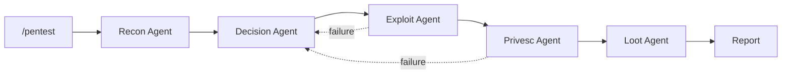

<p align="center">
  
</p>

# Clicky - If Claude were a Pentester

A multi-agent penetration testing framework powered by Claude. Clicky orchestrates specialized agents to perform comprehensive security assessments using decision tree logic derived from pentesting research.

## Overview

Clicky combines intelligent agent orchestration with attack methodologies derived from pentesting research. It supports traditional infrastructure, cloud environments, containers, APIs, and Active Directory.



## Quick Start

```bash
# Basic scan
/pentest 10.10.10.10

# With known credentials
/pentest 10.10.10.10 "user: admin, password: Password123"

# Cloud/API target
/pentest api.example.com "cloud: AWS, service: kubernetes"
```

## Legend

| Symbol | Meaning |
|--------|---------|
| `[Agent]` | Specialized Claude agent with defined role |
| `-->` | Sequential execution flow |
| `-.->` | Conditional/fallback flow |
| `Phase N` | Workflow stage number |
| `T####` | MITRE ATT&CK technique ID |

### Agent Color Codes

| Agent | Color | Purpose |
|-------|-------|---------|
| Recon | Blue | Target enumeration and reconnaissance |
| Decision | Purple | Strategic analysis and attack planning |
| Exploit | Red | Initial access and vulnerability exploitation |
| Privesc | Yellow | Privilege escalation (user to root/admin) |
| Loot | Green | Data extraction and credential harvesting |
| Cloud Recon | Cyan | Cloud and container enumeration |

### Priority Levels

| Priority | Description | Action |
|----------|-------------|--------|
| P1 | Critical | Immediate exploitation recommended |
| P2 | High | Exploit after P1 exhausted |
| P3 | Medium | Standard attack vector |
| P4 | Low | Last resort or supplementary |

### Success Rate Indicators

| Rate | Symbol | Meaning |
|------|--------|---------|
| 90-100% | `[+++]` | Highly reliable |
| 70-89% | `[++]` | Generally successful |
| 50-69% | `[+]` | Moderate success |
| <50% | `[-]` | Low probability |

## Directory Structure

```text
Clicky/
|-- .claude/
|   |-- agents/          # Agent definitions (markdown with YAML frontmatter)
|   |-- commands/        # Slash commands (/pentest)
|   |-- skills/          # SKILL.md files with scripts/references/assets
|   |-- workflows/       # Multi-phase execution plans
|   |-- hooks/           # Event triggers
|-- docs/                # Detailed documentation
```

## Core Components

### Agents (6)

Agents are defined in `.claude/agents/` as markdown files with YAML frontmatter specifying model, tools, and skills.

- **recon-agent**: Port scanning, service detection, environment fingerprinting
- **decision-agent**: Strategic analysis, attack prioritization based on pentesting research
- **exploit-agent**: Service exploitation, shell acquisition
- **privesc-agent**: Linux/Windows privilege escalation
- **loot-agent**: Credential harvesting, data extraction
- **cloud-recon-agent**: AWS/Azure/GCP/Kubernetes enumeration

### Commands

Commands are defined in `.claude/commands/` as markdown files.

- `/pentest <target> ["context"]` - Primary pentesting command

### Skills (22)

Skills are defined in `.claude/skills/{skill-name}/SKILL.md` with optional `scripts/`, `references/`, and `assets/` subdirectories.

## Documentation

See the [docs/](docs/) directory for detailed documentation:

| Document | Description |
|----------|-------------|
| [Usage Guide](docs/usage.md) | How to use Clicky - start here |
| [Architecture](docs/architecture.md) | System design and component interaction |
| [Agents](docs/agents.md) | Detailed agent specifications |
| [Workflow](docs/workflow.md) | Execution phases and decision logic |
| [Skills](docs/skills.md) | Available skill modules |

## Requirements

- Claude Code CLI
- nmap, hydra, sqlmap (exploitation tools)
- Network access to target

## Ethical Use

This framework is for authorized security testing only. Always obtain written permission before testing. Respect scope boundaries and avoid destructive actions.

## License

For authorized penetration testing use only.
