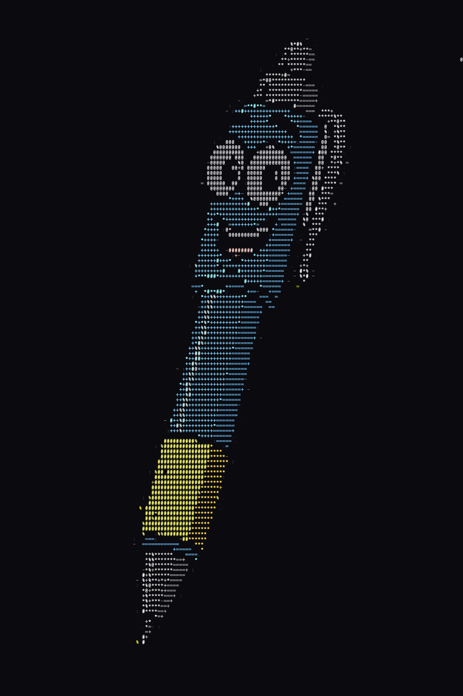
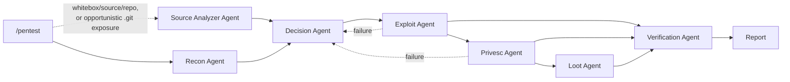

<p align="center">
  
</p>

# Clicky - If Claude were a Pentester

A multi-agent penetration testing framework powered by Claude. Clicky orchestrates specialized agents to perform comprehensive security assessments using attack-priority logic that self-calibrates from your own accumulated session history (real measured success rates once enough data exists, honestly-labeled heuristic ordering until then - see [Skills](docs/skills.md#htb-decision-tree)), not a fixed external dataset claim.

## Overview

Clicky combines intelligent agent orchestration with attack-priority ordering that self-calibrates from your own session history (see above). It supports traditional infrastructure, cloud environments, containers, APIs, and Active Directory. Every agent reaches the target exclusively through an MCP privacy gateway that tokenizes real target/credential values before they ever reach the model (see below).


```mermaid
flowchart LR
    A["/pentest"] --> B[Recon Agent]
    A -.->|whitebox/source/repo,<br/>or opportunistic .git exposure| S[Source Analyzer Agent]
    S --> C[Decision Agent]
    B --> C
    C --> D[Exploit Agent]
    D --> E[Privesc Agent]
    E --> F[Loot Agent]
    D --> V[Verification Agent]
    E --> V
    F --> V
    V --> G[Report]

    D -.->|failure| C
    E -.->|failure| C
```

Every agent calls the target only through the `clicky-gateway` MCP server (see [Architecture](docs/architecture.md#security-model)): its `register_target` tool checks the target against the engagement's `scope.json` automatically before minting the token an agent then uses for every subsequent `execute_command`/`fetch_url`/etc. call, replacing an earlier always-on `PreToolUse` hook (see [Sandboxing](docs/sandboxing.md) for the opt-in OS-level layer on top). The same gateway also tokenizes real target IPs/hostnames and any discovered credentials before they ever reach the model, resolving them back to real values only at actual execution time - see [Skills](docs/skills.md#mcp-gateway).

## Installation

Clicky is built as a Claude Code plugin. Install it locally for development, or add it via its bundled marketplace:

```bash
# Local development: run from a clone of this repo
claude --plugin-dir .

# Or install via the marketplace this repo ships
/plugin marketplace add goldenapplestudios/Clicky
/plugin install clicky@clicky
```

### OpenCode

Clicky also runs under [OpenCode](https://opencode.ai), generated from the same `agents/*.md`/`commands/*.md` source of truth via `tools/generate-cli-targets.py` (checked-in output, no need to run the generator yourself unless you're editing an agent). From a clone of this repo with `opencode` installed:

```bash
opencode run "Recon example.com" --agent recon-agent   # or: opencode, then /pentest <target>
```

The generated `.opencode/agents/*.md` carry the exact same "no direct tool access, gateway only" security model as the Claude Code agents - each one explicitly denies every OpenCode built-in tool (`bash`/`edit`/`write`/`read`/etc.) and allows only its specific `clicky-gateway_*` MCP tools, confirmed live against a real installed binary (see `tools/generate-cli-targets.py`'s own doc comments for the full verification record, including a real adversarial test and a real end-to-end scan).

### Codex CLI

Also generated for [Codex CLI](https://developers.openai.com/codex) - agents live in `.codex/agents/*.toml`, project-scoped and need no install step, but Codex's MCP-server registration and custom prompts are confirmed global-only (no project-relative equivalent Codex will discover), so run the one-time installer first:

```bash
./.codex/install.sh                                    # registers the gateway + prompts globally (safe to re-run)
./tools/run-clicky-agent.sh "Recon example.com"         # not a bare `codex exec` - see why below
```

`run-clicky-agent.sh` pins `-m gpt-5.4` and passes `--disable shell_tool` on every invocation - both are real, live-confirmed requirements, not defaults: Codex's own default model has an open upstream bug (`openai/codex#32101`) that silently drops MCP tool exposure for some models, and Codex has no `permission: deny`-style mechanism the way OpenCode does, so `--disable shell_tool` is the confirmed-working lever for denying direct shell access while keeping gateway tools available. Both were found and fixed after an initial live test looked like a hard blocker - see `tools/generate-cli-targets.py`'s Codex section doc comment for the full story, including why containerizing wouldn't have helped (the bug is proven application-level, not environment-level) and how a real adversarial test and a real end-to-end scan against `scanme.nmap.org` confirmed the fix.

### Copilot CLI

Also generated for [GitHub Copilot CLI](https://docs.github.com/en/copilot/concepts/agents/about-copilot-cli) (the standalone `copilot` binary, not `gh copilot` or the VS Code extension) - agents live in `.github/agents/*.md`, fully project-scoped, no install step needed:

```bash
./tools/run-clicky-copilot-agent.sh "Recon example.com"
```

Each generated agent embeds its own MCP server registration directly in its frontmatter rather than relying on a shared workspace `.mcp.json` - confirmed live that workspace-level MCP config is currently broken in Copilot CLI (`github/copilot-cli#3126`, open) and never actually reaches the model, even though it registers without error. Skills are exposed via a `.claude/skills -> ../skills` symlink, which Copilot CLI reads natively. See `tools/generate-cli-targets.py`'s Copilot section doc comment for the full verification record, including a real adversarial shell-denial test and a real orchestrator-to-leaf-agent delegation via Copilot's `task` tool.

## Quick Start

```bash
# Basic scan
/clicky:pentest 10.10.10.10

# With known credentials
/clicky:pentest 10.10.10.10 "user: admin, password: Password123"

# Cloud/API target
/clicky:pentest api.example.com "cloud: AWS, service: kubernetes"
```

For faster runs against targets with multiple independent services, `/clicky:pentest-parallel` tests them concurrently instead of one at a time (requires Claude Code v2.1.154+ and a paid plan — see [Workflow](docs/workflow.md) for the trade-offs).

## Legend

| Symbol | Meaning |
|--------|---------|
| `[Agent]` | Specialized Claude agent with defined role |
| `-->` | Sequential execution flow |
| `-.->` | Conditional/fallback flow |
| `Phase N` | Workflow stage number |
| `T####` | MITRE ATT&CK technique ID |

### Agent Color Codes

| Agent | Color | Purpose |
|-------|-------|---------|
| Recon | Blue | Target enumeration and reconnaissance |
| Decision | Purple | Strategic analysis and attack planning |
| Exploit | Red | Initial access and vulnerability exploitation |
| Privesc | Yellow | Privilege escalation (user to root/admin) |
| Loot | Green | Data extraction and credential harvesting |
| Cloud Recon | Cyan | Cloud and container enumeration |
| Source Analyzer | Pink | White-box source-code analysis |
| Verification | Orange | Independent re-check of CRITICAL/HIGH findings |

### Priority Levels

| Priority | Description | Action |
|----------|-------------|--------|
| P1 | Critical | Immediate exploitation recommended |
| P2 | High | Exploit after P1 exhausted |
| P3 | Medium | Standard attack vector |
| P4 | Low | Last resort or supplementary |

### Success Rate Indicators

| Rate | Symbol | Meaning |
|------|--------|---------|
| 90-100% | `[+++]` | Highly reliable |
| 70-89% | `[++]` | Generally successful |
| 50-69% | `[+]` | Moderate success |
| <50% | `[-]` | Low probability |

## Directory Structure

```text
Clicky/
|-- .claude-plugin/
|   |-- plugin.json      # Plugin manifest
|   |-- marketplace.json # Self-hosted marketplace listing
|-- agents/               # Agent definitions (markdown with YAML frontmatter)
|-- commands/              # Slash commands (/pentest)
|-- skills/                # SKILL.md files with scripts/references/assets
|-- workflows/             # Dynamic workflow scripts (/pentest-parallel)
|-- hooks/                 # Event triggers (hooks.json)
|-- docs/                  # Detailed documentation
```

## Core Components

### Agents (9)

Agents are defined in `agents/` as markdown files with YAML frontmatter specifying model, tools, and skills. Every agent's `tools:` list is exclusively `mcp__plugin_clicky_clicky-gateway__*` gateway tools - no agent holds a direct Bash/Read/Write/Glob/Grep grant (see [Architecture](docs/architecture.md#security-model)).

- **recon-agent**: Port scanning, service detection, environment fingerprinting
- **decision-agent**: Strategic analysis, attack prioritization based on pentesting research
- **exploit-agent**: Service exploitation, shell acquisition
- **privesc-agent**: Linux/Windows privilege escalation
- **loot-agent**: Credential harvesting, data extraction
- **cloud-recon-agent**: AWS/Azure/GCP/Kubernetes enumeration
- **source-analyzer-agent**: White-box source-code analysis - source-to-sink mapping and vulnerable dependencies, feeding decision-agent as a parallel input (see [Agents](docs/agents.md#source-analyzer-agent))
- **verification-agent**: Independently re-checks CRITICAL/HIGH findings against raw trace evidence before they reach the report (see [Agents](docs/agents.md#verification-agent))
- **report-agent**: Synthesizes already-validated session findings into the final client-facing report - CVSS/OWASP/CIS/NIST framework mapping, risk matrix, and narrative - replacing direct `report-generator.sh` invocation from the orchestrator (see [Agents](docs/agents.md#report-agent))

### Commands

Commands are defined in `commands/` as markdown files.

- `/pentest <target> ["context"]` - Primary pentesting command (namespaced as `/clicky:pentest` once installed as a plugin)
- `/clicky:pentest-parallel <target> ["context"]` - Dynamic-workflow equivalent that fans independent service checks out concurrently (see [Workflow](docs/workflow.md))
- `/clicky:sessions [session_id]` - List active sessions, or show detailed status for one (active or archived)
- `/clicky:resume <session_id>` - Resume a session for further work
- `/clicky:archive <session_id>` - Archive a completed session

### Skills (27)

Skills are defined in `skills/{skill-name}/SKILL.md` with optional `scripts/`, `references/`, and `assets/` subdirectories. The two newest: **mcp-gateway** - the privacy/tokenization gateway architecture described above; **subdomain-enumeration** - crt.sh/Subfinder/Amass-based attack-surface mapping with takeover detection, run by recon-agent's Phase 0. **evasion-techniques** (AV/EDR/IDS/IPS/forensic-detection avoidance) was restored after an earlier scope-narrowing decision predating confirmed authorization safeguards - see [Ethical Use](#ethical-use) below. See [Skills](docs/skills.md) for the full list.

## Documentation

See the [docs/](docs/) directory for detailed documentation:

| Document | Description |
|----------|-------------|
| [Usage Guide](docs/usage.md) | How to use Clicky - start here |
| [Architecture](docs/architecture.md) | System design and component interaction |
| [Agents](docs/agents.md) | Detailed agent specifications |
| [Workflow](docs/workflow.md) | Execution phases and decision logic |
| [Skills](docs/skills.md) | Available skill modules |
| [Observability](docs/observability.md) | Trace logs and OpenTelemetry - reviewing what happened in a run |
| [Sandboxing](docs/sandboxing.md) | Using Claude Code's sandboxed Bash tool alongside Clicky's own scope enforcement |
| [Competitive Landscape](docs/competitive-landscape.md) | How Clicky compares to real open-source/academic frameworks and commercial platforms in this space, and to published benchmarks |

## Requirements

- Claude Code CLI
- nmap, hydra, sqlmap (exploitation tools)
- Network access to target
- If you enable Claude Code's sandboxed Bash tool for an engagement (see [Sandboxing](docs/sandboxing.md)), note that `docker` is entirely incompatible with it - container-security testing needs a `sandbox.excludedCommands: ["docker *"]` carve-out and runs fully unsandboxed whenever that's active.

## Ethical Use

This framework is for authorized security testing only. Always obtain written permission before testing. Respect scope boundaries and avoid destructive actions.

Ethical safety here is enforced structurally - the MCP gateway's automatic scope check on `register_target` and the written-authorization requirement above - not by withholding technique capability from `exploit-agent`/`loot-agent`/`privesc-agent`. Their full technique coverage (SQLi, AD attacks, container/cloud escapes, API exploitation, AV/EDR/IDS/IPS evasion, etc.) is core, required functionality for a working pentesting tool, on par with what Metasploit or Burp Suite ship; it is in scope for this project and shouldn't be pruned. The standalone `evasion-techniques` skill (AV/EDR/IDS/IPS/forensic-detection avoidance) was removed once during an earlier scope-narrowing pass, pending confirmation that the same structural authorization safeguards described above were sufficient for it too - it has since been restored now that they are: evasion technique documentation is a standard, expected part of an authorized red-team engagement testing whether an organization's defensive tooling actually catches a sophisticated attacker, gated by the exact same written-authorization requirement as everything else in this framework, not a separate carve-out.

## License

For authorized penetration testing use only.
