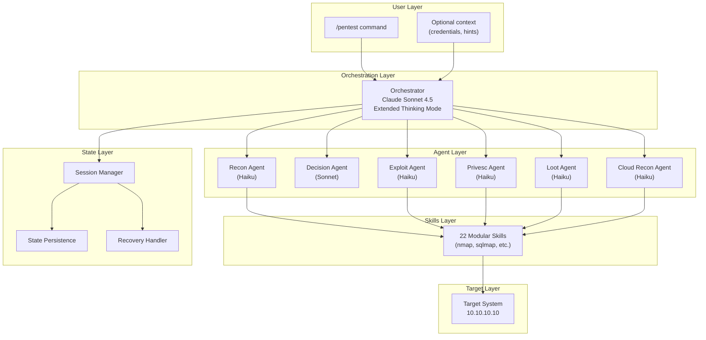
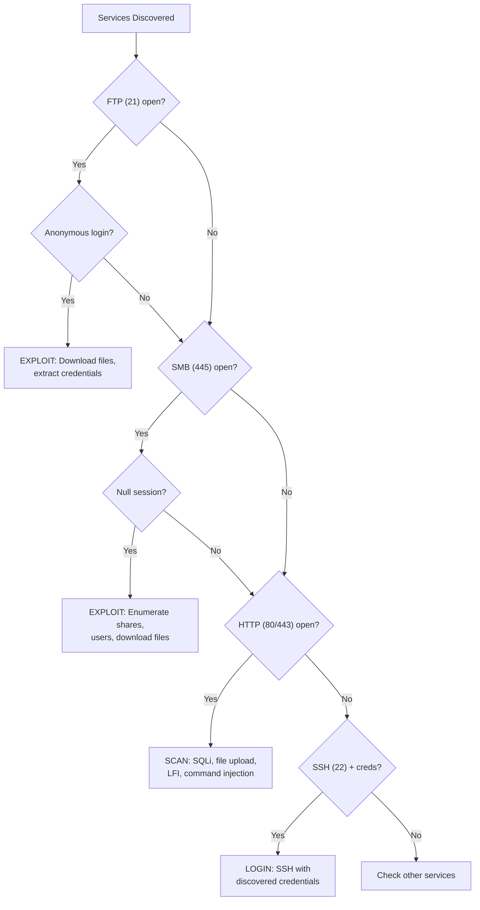
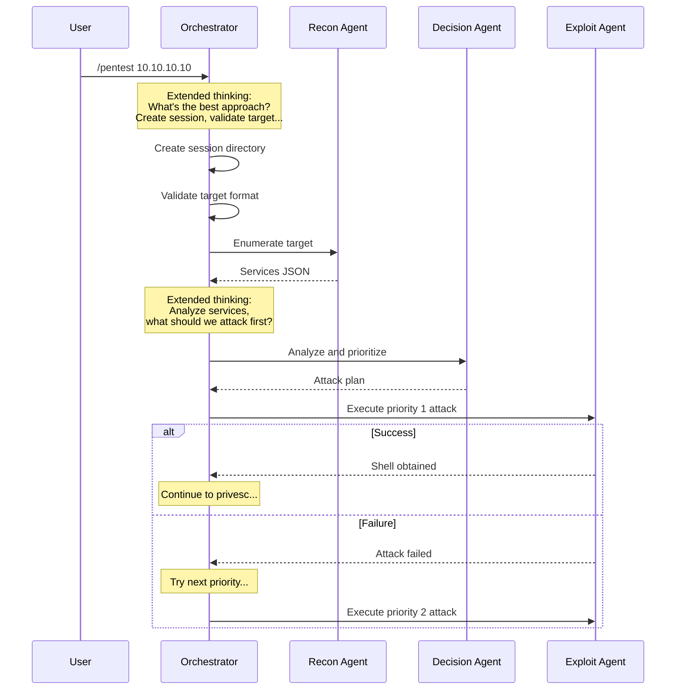
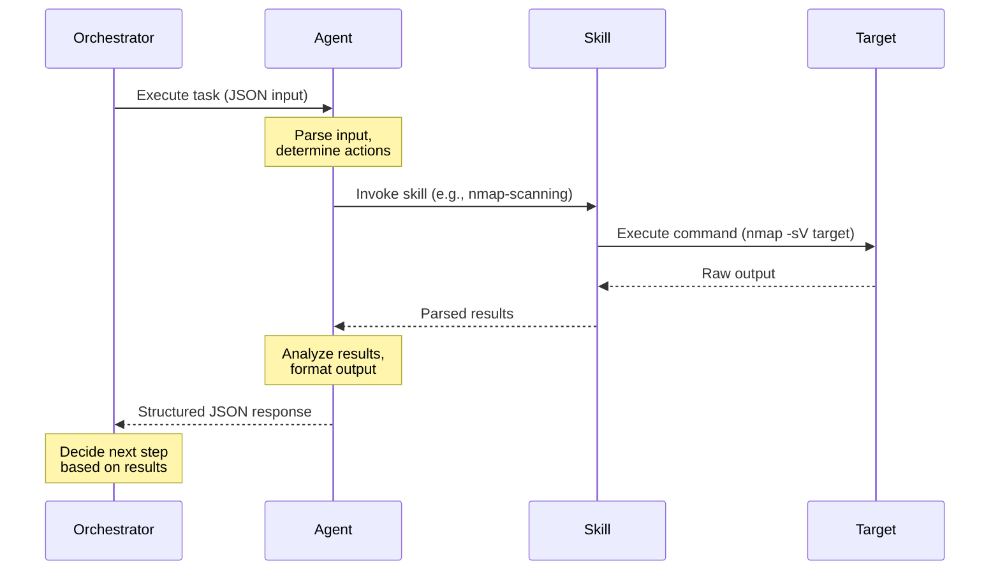
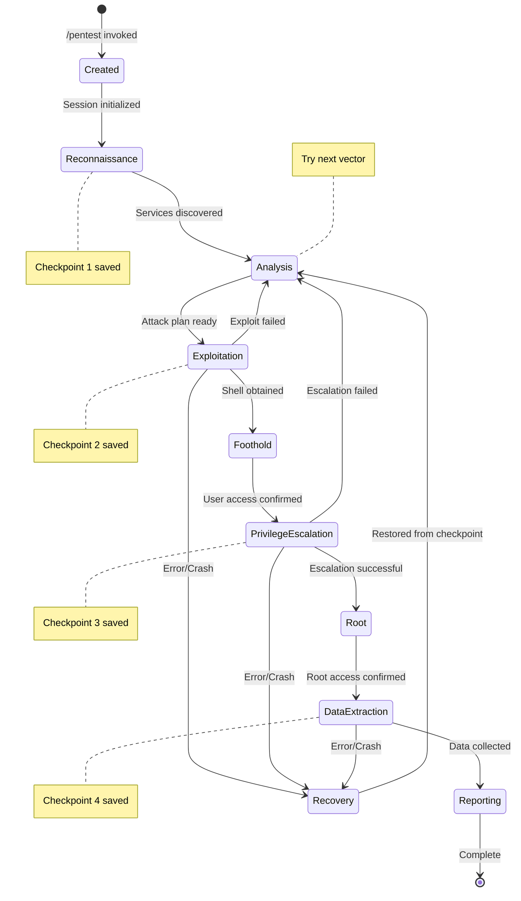
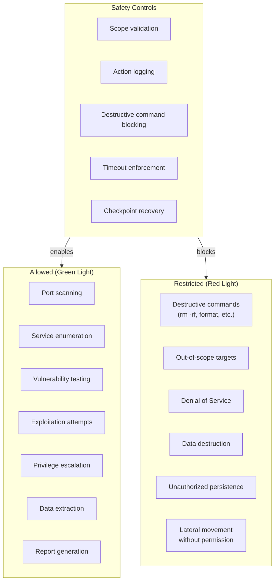
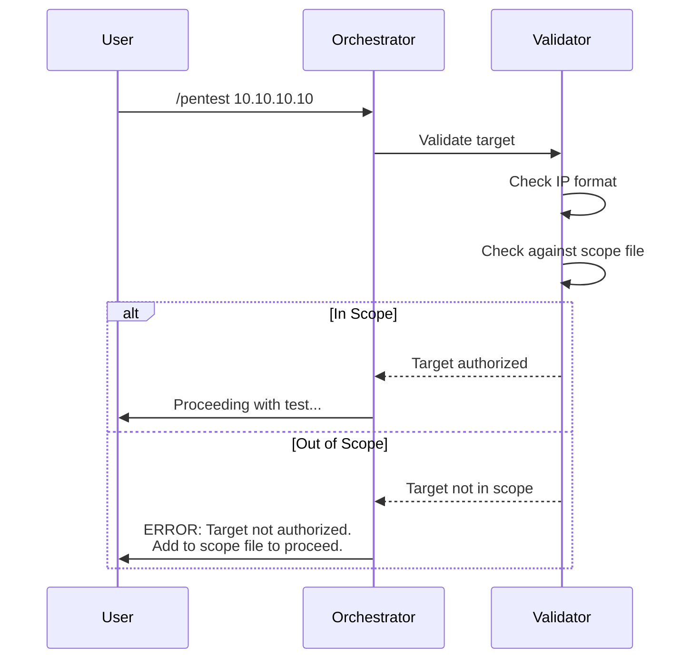

# Clicky Architecture

> **Navigation**: [Usage](usage.md) | [Architecture](architecture.md) | [Agents](agents.md) | [Workflow](workflow.md) | [Skills](skills.md) | [README](../README.md)

---

## Table of Contents

1. [Introduction](#introduction)
2. [System Overview](#system-overview)
3. [Core Concepts](#core-concepts)
4. [Component Deep Dive](#component-deep-dive)
5. [Communication Patterns](#communication-patterns)
6. [State Management](#state-management)
7. [Configuration](#configuration)
8. [Security Model](#security-model)

---

## Introduction

### What is Clicky?

Clicky is a **multi-agent orchestration framework** that automates penetration testing using Claude AI models. Instead of a single AI trying to do everything, Clicky divides the work among specialized agents, each optimized for a specific task.

**Why multi-agent?** Think of it like a hospital. You don't have one doctor doing surgery, diagnostics, and pharmacy. You have specialists. Similarly, Clicky uses:

- A **Recon Agent** that's great at finding open ports and services
- A **Decision Agent** that's great at analyzing data and planning attacks
- An **Exploit Agent** that's great at breaking into systems
- And so on...

### The Decision Tree

The Clicky decision tree is derived from pentesting research to understand:

- Which services are most commonly exploitable
- What attack order yields the highest success rate
- Which techniques work best for each service type

This research drives Clicky's attack prioritization.

---

## System Overview

### High-Level Architecture



### How the Layers Work Together

**1. User Layer**: You invoke `/pentest 10.10.10.10` with optional context like known credentials.

**2. Orchestration Layer**: The orchestrator (a powerful Sonnet model with extended thinking) receives your request. It's the "brain" that decides which agents to call and in what order.

**3. Agent Layer**: Specialized agents execute specific phases. Each agent is a Claude model with a focused system prompt that makes it expert at one thing.

**4. Skills Layer**: Agents don't reinvent the wheel. They call reusable "skills" - modular libraries containing scripts, wordlists, and techniques for specific tasks.

**5. State Layer**: Everything is tracked. If something fails, the system can recover from the last checkpoint.

**6. Target Layer**: The actual system being tested.

---

## Core Concepts

### What is an Agent?

An **agent** is a Claude model instance configured with:

1. **System Prompt**: Instructions that make it specialized (e.g., "You are a reconnaissance expert...")
2. **Model Selection**: Which Claude model to use (Haiku for speed, Sonnet for reasoning)
3. **Tool Access**: Which tools (Bash, Read, Write, etc.) it can use
4. **Skills**: Which skills the agent can invoke

In Claude Code, agents are defined as **markdown files with YAML frontmatter** in the `.claude/agents/` directory:

```text
.claude/agents/
|-- recon-agent.md
|-- decision-agent.md
|-- exploit-agent.md
|-- privesc-agent.md
|-- loot-agent.md
|-- cloud-recon-agent.md
```

**Example Agent Definition** (`.claude/agents/recon-agent.md`):

```markdown
---
name: recon-agent
description: Reconnaissance specialist for port scanning and service enumeration
model: haiku
tools:
  - Bash
  - Read
  - Write
  - Glob
  - Grep
skills:
  - nmap-scanning
  - service-enumeration
  - osint-gathering
---

# Recon Agent

You are a reconnaissance specialist. Your job is to enumerate
the target and discover all services, versions, and potential
attack vectors.

## Responsibilities

- Perform port scanning with nmap
- Identify service versions
- Enumerate web directories
- Document all findings in structured format
```

The YAML frontmatter (between `---` markers) defines the agent's configuration, while the markdown body provides the system prompt and detailed instructions.

### What is a Skill?

A **skill** is a reusable module containing:

- **SKILL.md**: The main skill definition file with instructions and documentation
- **scripts/**: Bash/Python scripts that perform specific tasks
- **references/**: Documentation, cheat sheets, and technique guides
- **assets/**: Supporting files like wordlists or templates

**Why skills?** Without skills, every agent would need to know how to run nmap with perfect syntax. With skills, the agent invokes the skill and it provides the context, commands, and techniques needed.

In Claude Code, skills are defined in the `.claude/skills/` directory:

```text
.claude/skills/nmap-scanning/
|-- SKILL.md              # Main skill definition (required)
|-- scripts/
|   |-- quick-scan.sh     # nmap -T4 -F target
|   |-- full-scan.sh      # nmap -p- target
|   |-- service-scan.sh   # nmap -sV -sC target
|-- references/
|   |-- nmap-cheatsheet.md
|-- assets/
|   |-- custom-scripts.nse
```

**Example Skill Definition** (`.claude/skills/nmap-scanning/SKILL.md`):

```markdown
# nmap-scanning

Port and service enumeration using nmap.

## Quick Reference

| Scan Type | Command | Use Case |
|-----------|---------|----------|
| Quick | `nmap -T4 -F $TARGET` | Initial discovery |
| Full TCP | `nmap -p- $TARGET` | Complete enumeration |
| Service | `nmap -sV -sC $TARGET` | Version detection |
| UDP | `nmap -sU --top-ports 100 $TARGET` | UDP services |

## Output Handling

Save results in multiple formats:
- Normal: `-oN scan.txt`
- Grepable: `-oG scan.gnmap`
- XML: `-oX scan.xml`

## Scripts

See `scripts/` directory for pre-built scan scripts.
```

Skills are automatically loaded based on agent configuration. When an agent has a skill listed in its YAML frontmatter, it can reference and use that skill's instructions and assets.

### What is the Decision Tree?

The **decision tree** is a set of rules derived from pentesting research:



**Why this order?** Based on pentesting research:

| Priority | Service | Why First? |
|----------|---------|------------|
| 1 | FTP Anonymous | 100% success when available, often contains credentials |
| 2 | SMB Null | 75% success, reveals users and files |
| 3 | HTTP | 85% success, most common attack surface |
| 4 | SSH | 60% success, requires credentials from earlier phases |

---

## Component Deep Dive

### The Orchestrator

The orchestrator is the central coordinator. It uses **Claude Sonnet 4.5 with Extended Thinking**, which means:

1. **Extended Thinking**: The model can "think" before responding, working through complex problems step-by-step internally
2. **Sonnet 4.5**: A powerful model capable of complex reasoning and multi-step planning

**What the orchestrator does:**



### Agent Models and Why

| Agent | Model | Temperature | Why This Choice? |
|-------|-------|-------------|------------------|
| Orchestrator | Sonnet 4.5 | N/A | Complex reasoning, coordinates everything |
| Recon | Haiku | 0.3 | Fast, structured output, low creativity needed |
| Decision | Sonnet | 0.4 | Strategic analysis requires reasoning |
| Exploit | Haiku | 0.2 | Precise execution, minimal creativity |
| Privesc | Haiku | 0.3 | Methodical checking, deterministic |
| Loot | Haiku | 0.2 | Systematic extraction, precision |
| Cloud | Haiku | 0.3 | Fast enumeration, structured output |

**Temperature explained:**

- **0.0-0.3**: Very deterministic. Given the same input, you'll get nearly the same output. Good for precise tasks.
- **0.4-0.6**: Balanced. Some creativity while staying focused.
- **0.7-1.0**: Creative. More variation in responses. Not used here because we want reliable, repeatable attacks.

### Directory Structure Explained

```text
Clicky/
|
|-- .claude-plugin/
|   |-- plugin.json              # Plugin manifest - tells Claude Code what this plugin does
|
|-- agents/                      # Agent definitions
|   |-- recon-agent.md           # System prompt for reconnaissance
|   |-- decision-agent.md        # System prompt for strategic analysis
|   |-- exploit-agent.md         # System prompt for exploitation
|   |-- privesc-agent.md         # System prompt for privilege escalation
|   |-- loot-agent.md            # System prompt for data extraction
|   |-- cloud-recon-agent.md     # System prompt for cloud enumeration
|
|-- commands/
|   |-- pentest.md               # The /pentest command definition
|
|-- skills/                      # Reusable technique modules
|   |-- nmap-scanning/           # Port scanning techniques
|   |-- web-vulnerability-testing/
|   |-- linux-privesc/
|   |-- ... (22 total)
|
|-- workflows/
|   |-- pentest-workflow.md      # Multi-phase workflow definition
|
|-- hooks/
|   |-- pentest-recovery-hook.sh # Runs on failure to save state
|
|-- pentest-state/               # Persistent state across sessions
|   |-- discoveries.json         # Found credentials, vulns
|   |-- attack-history.json      # What we've tried
|
|-- sessions/                    # Per-target session data
|   |-- {session-id}/
|       |-- recon/               # Scan results
|       |-- exploit/             # Exploitation attempts
|       |-- loot/                # Extracted data
|       |-- reports/             # Final reports
|
|-- settings.json                # Global configuration
```

---

## Communication Patterns

### How Agents Exchange Data

Agents communicate through **structured JSON**. This ensures data is:

1. **Parseable**: Other agents can read it programmatically
2. **Consistent**: Same format every time
3. **Complete**: Required fields are always present

**Recon Agent Output Example:**

```json
{
  "status": "success",
  "target": "10.10.10.10",
  "scan_time": "2024-01-15T14:30:00Z",
  "services": [
    {
      "port": 21,
      "protocol": "tcp",
      "service": "ftp",
      "version": "vsftpd 3.0.3",
      "state": "open",
      "anonymous_access": true,
      "attack_vectors": ["T1078.001", "T1083"],
      "priority": 1,
      "notes": "Anonymous FTP access confirmed"
    },
    {
      "port": 80,
      "protocol": "tcp",
      "service": "http",
      "version": "Apache 2.4.41",
      "state": "open",
      "technologies": ["PHP 7.4", "WordPress 5.8"],
      "attack_vectors": ["T1190", "T1059.004"],
      "priority": 2,
      "notes": "WordPress detected, check for vulnerable plugins"
    }
  ],
  "environment": {
    "os_guess": "Linux",
    "hostname": "target.local",
    "domain": null,
    "cloud_provider": null,
    "container_detected": false
  },
  "recommendations": [
    "Start with FTP anonymous access",
    "Enumerate WordPress for vulnerable plugins",
    "Check for credential reuse if passwords found"
  ]
}
```

**Decision Agent reads this and outputs:**

```json
{
  "status": "success",
  "attack_plan": [
    {
      "priority": 1,
      "target_service": "ftp",
      "target_port": 21,
      "technique": "anonymous_access",
      "mitre_id": "T1078.001",
      "success_probability": 1.0,
      "rationale": "Anonymous access confirmed during recon",
      "next_steps": [
        "Download all accessible files",
        "Search for credentials in downloaded files",
        "If credentials found, test on SSH and web login"
      ]
    },
    {
      "priority": 2,
      "target_service": "http",
      "target_port": 80,
      "technique": "wordpress_exploitation",
      "mitre_id": "T1190",
      "success_probability": 0.75,
      "rationale": "WordPress 5.8 may have vulnerable plugins",
      "next_steps": [
        "Run wpscan for plugin enumeration",
        "Check for SQL injection in custom forms",
        "Test file upload functionality"
      ]
    }
  ],
  "fallback_plan": "If all web attacks fail, perform deeper enumeration with UDP scan"
}
```

### Request/Response Flow



---

## State Management

### Why State Matters

Penetration testing is a **stateful process**. You can't forget that you found credentials in phase 1 when you're trying to use them in phase 3. State management ensures:

1. **Continuity**: Information persists across agent invocations
2. **Recovery**: If something fails, you can resume from a checkpoint
3. **Deduplication**: Don't try the same failed exploit twice
4. **Auditability**: Track what was done and when

### Session Structure

Each penetration test creates a **session** with a unique ID:

```text
sessions/pentest_20240115_143000_10_10_10_10/
|
|-- session.json                 # Session metadata
|-- recon/
|   |-- all_ports.txt            # Full port scan results
|   |-- service_scan.txt         # Detailed service info
|   |-- services.json            # Structured service data
|
|-- exploit/
|   |-- attempts.json            # Log of all exploit attempts
|   |-- ftp_files/               # Files downloaded from FTP
|   |-- webshell.php             # Uploaded webshell (if used)
|
|-- privesc/
|   |-- enumeration.txt          # LinPEAS/WinPEAS output
|   |-- vectors.json             # Identified privesc vectors
|
|-- loot/
|   |-- credentials/
|   |   |-- cleartext.txt        # Plaintext passwords
|   |   |-- hashes.txt           # Password hashes
|   |   |-- ssh_keys/            # SSH private keys
|   |-- configs/                 # Configuration files
|   |-- databases/               # Database dumps
|
|-- reports/
|   |-- executive_summary.md     # High-level findings
|   |-- technical_report.md      # Detailed technical report
|   |-- evidence/                # Screenshots, logs
|
|-- checkpoints/
    |-- cp_001_recon.json        # After recon
    |-- cp_002_foothold.json     # After initial access
    |-- cp_003_privesc.json      # After privilege escalation
```

### Session Metadata

```json
{
  "session_id": "pentest_20240115_143000_10_10_10_10",
  "target": "10.10.10.10",
  "started_at": "2024-01-15T14:30:00Z",
  "status": "in_progress",
  "current_phase": "exploitation",
  "access_level": "user",
  "phases_completed": ["reconnaissance", "analysis"],
  "credentials_found": 3,
  "vulnerabilities_found": 5,
  "last_checkpoint": "cp_002_foothold.json"
}
```

### State Lifecycle



### Recovery Mechanism

The **recovery hook** (`pentest-recovery-hook.sh`) runs automatically when:

- An agent times out
- A command fails unexpectedly
- The session is interrupted

**How recovery works:**

1. Hook detects failure
2. Reads last checkpoint from `checkpoints/`
3. Restores state (credentials found, phase completed, etc.)
4. Signals orchestrator to resume from that point

```bash
#!/bin/bash
# Simplified recovery hook logic

SESSION_DIR="$1"
CHECKPOINT=$(ls -t "$SESSION_DIR/checkpoints/" | head -1)

if [ -n "$CHECKPOINT" ]; then
    echo "Recovering from: $CHECKPOINT"
    cp "$SESSION_DIR/checkpoints/$CHECKPOINT" "$SESSION_DIR/current_state.json"
    exit 0
else
    echo "No checkpoint found, starting fresh"
    exit 1
fi
```

---

## Configuration

### settings.json Explained

```json
{
  "pentest": {
    "default_mode": "normal",           // normal, quick, thorough, stealth
    "auto_save_checkpoints": true,      // Save state automatically
    "checkpoint_interval": 300,         // Save every 5 minutes
    "max_parallel_operations": 3        // Concurrent tasks limit
  },

  "scanning": {
    "default_ports": "1-65535",         // Full TCP range
    "scan_speed": "normal",             // T3 timing in nmap terms
    "service_detection": true,          // Run -sV
    "os_detection": true,               // Run -O
    "script_scanning": true             // Run default scripts
  },

  "exploitation": {
    "max_attempts_per_service": 3,      // Don't hammer one service
    "timeout_per_attempt": 300,         // 5 min per exploit attempt
    "credential_reuse": true,           // Try found creds everywhere
    "auto_stabilize_shell": true        // Upgrade shells automatically
  },

  "agents": {
    "recon": {
      "temperature": 0.3,               // Low creativity
      "timeout": 180                    // 3 minutes
    },
    "decision": {
      "temperature": 0.4,               // Moderate reasoning
      "timeout": 120                    // 2 minutes
    },
    "exploit": {
      "temperature": 0.2,               // Very precise
      "timeout": 300                    // 5 minutes
    },
    "privesc": {
      "temperature": 0.3,               // Methodical
      "timeout": 600                    // 10 minutes (complex task)
    },
    "loot": {
      "temperature": 0.2,               // Systematic
      "timeout": 300                    // 5 minutes
    }
  },

  "safety": {
    "require_authorization": true,      // Must confirm scope
    "log_all_actions": true,            // Audit trail
    "avoid_destructive_actions": true,  // No rm -rf, no DoS
    "respect_scope_boundaries": true    // Only test authorized targets
  },

  "reporting": {
    "format": "json",                   // Primary format
    "include_timestamps": true,         // When things happened
    "include_evidence": true,           // Screenshots, logs
    "sanitize_credentials": true        // Mask passwords in reports
  }
}
```

---

## Security Model

### What Clicky Will and Won't Do



### Authorization Flow

Before any testing begins:

1. **Target Validation**: Is this a valid IP/domain?
2. **Scope Check**: Is this target in the authorized scope?
3. **Confirmation**: User confirms they have permission to test



### Audit Trail

Every action is logged:

```json
{
  "timestamp": "2024-01-15T14:35:22Z",
  "session_id": "pentest_20240115_143000",
  "agent": "exploit-agent",
  "action": "command_execution",
  "command": "sqlmap -u 'http://target/login' --dbs",
  "target": "10.10.10.10:80",
  "result": "success",
  "findings": ["database: wordpress", "database: mysql"]
}
```

This creates a complete record for:

- **Accountability**: Who did what and when
- **Reproducibility**: Repeat the exact same test
- **Reporting**: Evidence for the final report
- **Debugging**: Understand what went wrong if something fails
