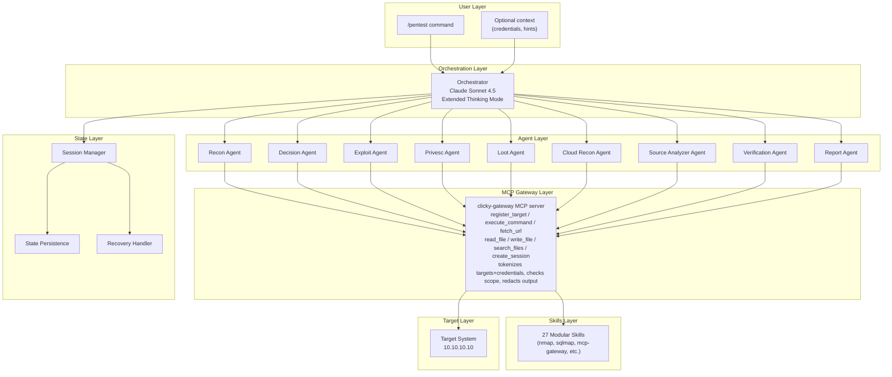
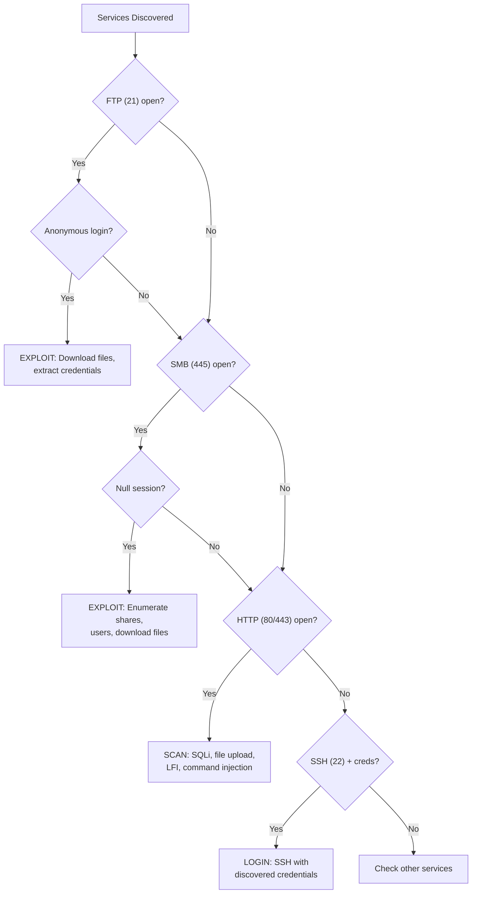
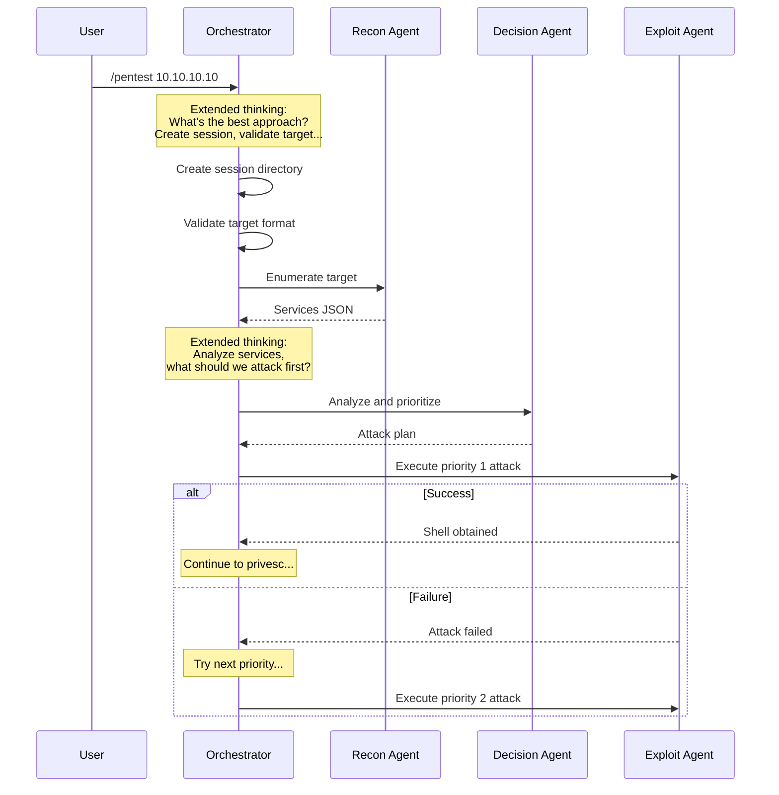
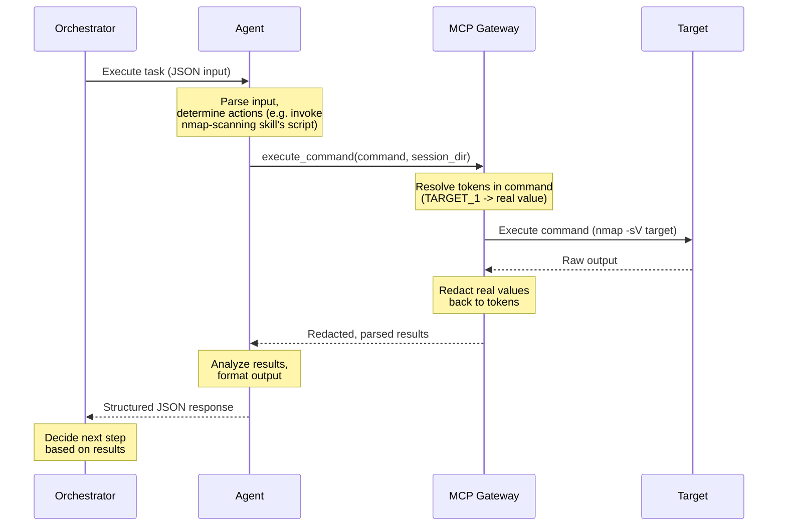
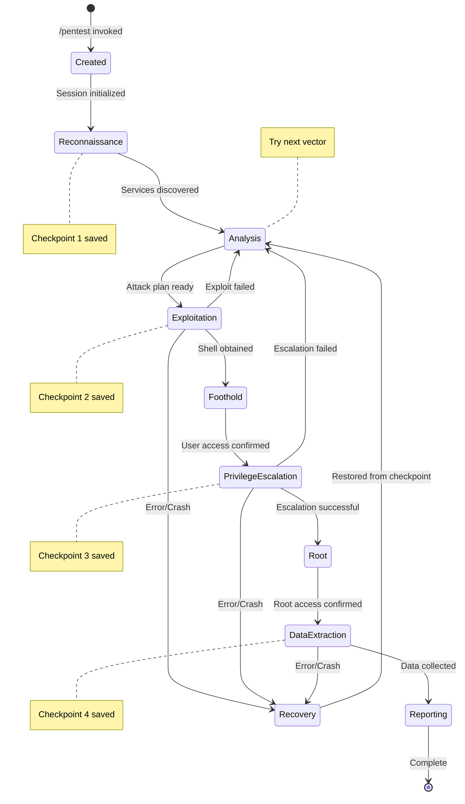
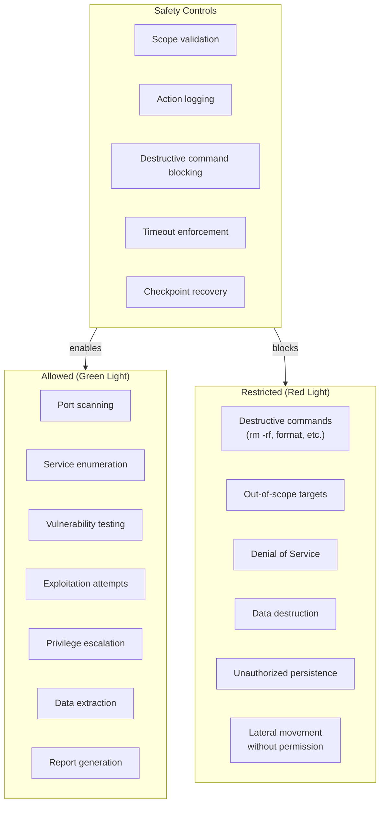
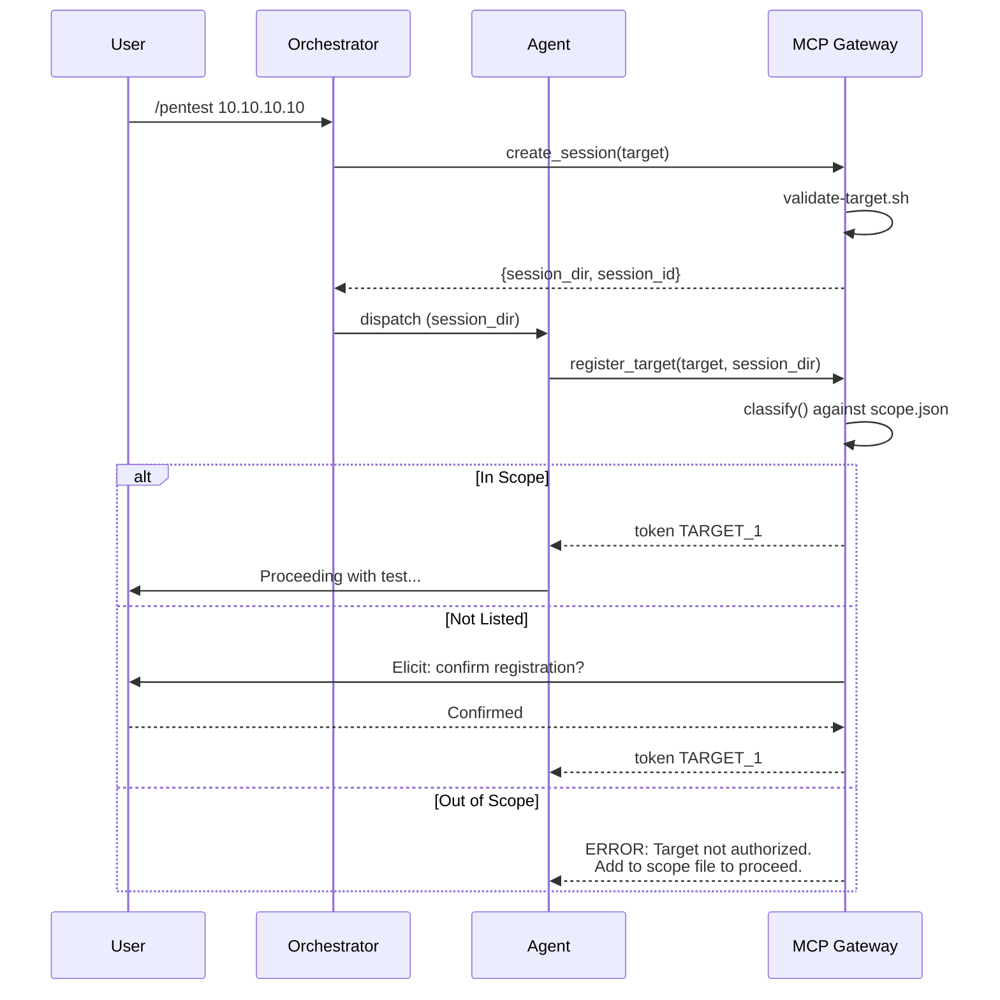

# Clicky Architecture

> **Navigation**: [Usage](usage.md) | [Architecture](architecture.md) | [Agents](agents.md) | [Workflow](workflow.md) | [Skills](skills.md) | [Observability](observability.md) | [Sandboxing](sandboxing.md) | [README](../README.md)

---

## Table of Contents

1. [Introduction](#introduction)
2. [System Overview](#system-overview)
3. [Core Concepts](#core-concepts)
4. [Component Deep Dive](#component-deep-dive)
5. [Communication Patterns](#communication-patterns)
6. [State Management](#state-management)
7. [Configuration](#configuration)
8. [Security Model](#security-model)

---

## Introduction

### What is Clicky?

Clicky is a **multi-agent orchestration framework** that automates penetration testing using Claude AI models. Instead of a single AI trying to do everything, Clicky divides the work among specialized agents, each optimized for a specific task.

**Why multi-agent?** Think of it like a hospital. You don't have one doctor doing surgery, diagnostics, and pharmacy. You have specialists. Similarly, Clicky uses:

- A **Recon Agent** that's great at finding open ports and services
- A **Decision Agent** that's great at analyzing data and planning attacks
- An **Exploit Agent** that's great at breaking into systems
- And so on...

### The Decision Tree

The Clicky decision tree's shape (which service to check, what order to try things in) is a reasonable heuristic starting point; the priority *weighting* behind it - which services are most commonly exploitable, what attack order yields the highest success rate - is self-calibrated from this operator's own accumulated session history (`skills/htb-decision-tree`, see that skill's SKILL.md), not a fixed external research citation. It starts as an honestly-labeled heuristic on a fresh install and gets more accurate as real engagement data accumulates.

---

## System Overview

### High-Level Architecture


```mermaid
flowchart TB
    subgraph UserLayer["User Layer"]
        CMD["/pentest command"]
        CTX["Optional context<br/>(credentials, hints)"]
    end

    subgraph OrchLayer["Orchestration Layer"]
        ORCH["Orchestrator<br/>Claude Sonnet 4.5<br/>Extended Thinking Mode"]
    end

    subgraph AgentLayer["Agent Layer"]
        RECON["Recon Agent"]
        DECISION["Decision Agent"]
        EXPLOIT["Exploit Agent"]
        PRIVESC["Privesc Agent"]
        LOOT["Loot Agent"]
        CLOUD["Cloud Recon Agent"]
        SOURCE["Source Analyzer Agent"]
        VERIFY["Verification Agent"]
        REPORT["Report Agent"]
    end

    subgraph GatewayLayer["MCP Gateway Layer"]
        GW["clicky-gateway MCP server<br/>register_target / execute_command / fetch_url<br/>read_file / write_file / search_files / create_session<br/>tokenizes targets+credentials, checks scope, redacts output"]
    end

    subgraph SkillLayer["Skills Layer"]
        SKILLS["27 Modular Skills<br/>(nmap, sqlmap, mcp-gateway, etc.)"]
    end

    subgraph StateLayer["State Layer"]
        SESSION["Session Manager"]
        PERSIST["State Persistence"]
        RECOVER["Recovery Handler"]
    end

    subgraph TargetLayer["Target Layer"]
        TARGET["Target System<br/>10.10.10.10"]
    end

    CMD --> ORCH
    CTX --> ORCH
    ORCH --> RECON
    ORCH --> DECISION
    ORCH --> EXPLOIT
    ORCH --> PRIVESC
    ORCH --> LOOT
    ORCH --> CLOUD
    ORCH --> SOURCE
    ORCH --> VERIFY
    ORCH --> REPORT

    RECON --> GW
    DECISION --> GW
    EXPLOIT --> GW
    PRIVESC --> GW
    LOOT --> GW
    CLOUD --> GW
    SOURCE --> GW
    VERIFY --> GW
    REPORT --> GW

    GW --> SKILLS
    GW --> TARGET

    ORCH --> SESSION
    SESSION --> PERSIST
    SESSION --> RECOVER
```

### How the Layers Work Together

**1. User Layer**: You invoke `/pentest 10.10.10.10` with optional context like known credentials.

**2. Orchestration Layer**: The orchestrator (a powerful Sonnet model with extended thinking) receives your request. It's the "brain" that decides which agents to call and in what order.

**3. Agent Layer**: Specialized agents execute specific phases. Each agent is a Claude model with a focused system prompt that makes it expert at one thing. No agent holds a direct `Bash`/`Read`/`Write`/`Glob`/`Grep`/`WebFetch` tool grant anymore - every action an agent takes goes through the layer below instead.

**4. MCP Gateway Layer**: A single long-lived MCP server (`skills/mcp-gateway`) sits between every agent and the real target. Agents call its 7 tools (`register_target`, `execute_command`, `fetch_url`, `read_file`, `write_file`, `search_files`, `create_session`) using tokens (`TARGET_1`, `CRED_HASH_1`, ...) instead of raw IPs, hostnames, or credentials. The gateway resolves those tokens to real values immediately before executing a command/fetch/file operation, checks the target against the engagement's `scope.json` (on `register_target`), performs the real operation, and redacts real values back to tokens in whatever it returns - so raw target/credential values are used at execution time but never need to flow through the model's own context in either direction.

**5. Skills Layer**: Agents don't reinvent the wheel. They call reusable "skills" - modular libraries containing scripts, wordlists, and techniques for specific tasks - and the gateway's `execute_command`/`read_file`/etc. are what actually run those skills' scripts against the target.

**6. State Layer**: Everything is tracked. If something fails, the system can recover from the last checkpoint.

**7. Target Layer**: The actual system being tested. Only the gateway ever touches it directly - real values reach the target at execution time, resolved from tokens server-side.

---

## Core Concepts

### What is an Agent?

An **agent** is a Claude model instance configured with:

1. **System Prompt**: Instructions that make it specialized (e.g., "You are a reconnaissance expert...")
2. **Model Selection**: Which Claude model to use (Haiku for speed, Sonnet for reasoning)
3. **Tool Access**: Which of the MCP gateway's tools (`register_target`, `execute_command`, `fetch_url`, `read_file`, `write_file`, `search_files`, `create_session`) it can call - no agent holds a direct `Bash`/`Read`/`Write`/`Glob`/`Grep` grant
4. **Skills**: Which skills the agent can invoke

In Claude Code, agents are defined as **markdown files with YAML frontmatter** in the `agents/` directory:

```text
agents/
|-- recon-agent.md
|-- decision-agent.md
|-- exploit-agent.md
|-- privesc-agent.md
|-- loot-agent.md
|-- cloud-recon-agent.md
|-- source-analyzer-agent.md
|-- verification-agent.md
|-- report-agent.md
```

**Example Agent Definition** (`agents/recon-agent.md`, frontmatter as it actually reads today):

```markdown
---
name: recon-agent
description: Performs reconnaissance and enumeration of target systems including port scanning, service discovery, and vulnerability identification
model: inherit
color: blue
tools: mcp__plugin_clicky_clicky-gateway__register_target, mcp__plugin_clicky_clicky-gateway__execute_command, mcp__plugin_clicky_clicky-gateway__fetch_url, mcp__plugin_clicky_clicky-gateway__read_file, mcp__plugin_clicky_clicky-gateway__search_files
skills: nmap-scanning, service-enumeration, osint-gathering, web-vulnerability-testing, target-validation, web-auth-capture, fuzzing, web-crawling, session-management, htb-decision-tree, tool-management, subdomain-enumeration
---

# Recon Agent - Target Enumeration Specialist
...
```

Every agent's `tools:` list is a subset of the 7 `mcp__plugin_clicky_clicky-gateway__*` gateway tools (`register_target`, `execute_command`, `fetch_url`, `read_file`, `write_file`, `search_files`, `create_session`) - never `Bash`, `Read`, `Write`, `Glob`, or `Grep` directly. Which subset an agent gets reflects what it actually needs: `recon-agent` gets `register_target` (it's the first agent to see a new target) but not `write_file`; `verification-agent` gets neither `register_target` nor `write_file` (it re-checks existing findings against an already-registered target and never fabricates new ones); `report-agent` gets `write_file` but not `register_target` or `fetch_url` (it only ever touches already-collected session data, never the live target). See each agent's own "Gateway Calling Convention" section (e.g. `agents/recon-agent.md`, `agents/verification-agent.md`) for the full rationale and calling pattern - notably, every gateway call requires an explicit `session_dir` argument; nothing is read from an environment variable or a pointer file.

The YAML frontmatter (between `---` markers) defines the agent's configuration, while the markdown body provides the system prompt and detailed instructions.

### What is a Skill?

A **skill** is a reusable module containing:

- **SKILL.md**: The main skill definition file with instructions and documentation
- **scripts/**: Bash/Python scripts that perform specific tasks
- **references/**: Documentation, cheat sheets, and technique guides
- **assets/**: Supporting files like wordlists or templates

**Why skills?** Without skills, every agent would need to know how to run nmap with perfect syntax. With skills, the agent invokes the skill and it provides the context, commands, and techniques needed.

In Claude Code, skills are defined in the `skills/` directory:

```text
skills/nmap-scanning/
|-- SKILL.md              # Main skill definition (required)
|-- scripts/
|   |-- quick-scan.sh     # nmap -T4 -F target
|   |-- full-scan.sh      # nmap -p- target
|   |-- service-scan.sh   # nmap -sV -sC target
|-- references/
|   |-- nmap-cheatsheet.md
|-- assets/
|   |-- custom-scripts.nse
```

**Example Skill Definition** (`skills/nmap-scanning/SKILL.md`):

```markdown
# nmap-scanning

Port and service enumeration using nmap.

## Quick Reference

| Scan Type | Command | Use Case |
|-----------|---------|----------|
| Quick | `nmap -T4 -F $TARGET` | Initial discovery |
| Full TCP | `nmap -p- $TARGET` | Complete enumeration |
| Service | `nmap -sV -sC $TARGET` | Version detection |
| UDP | `nmap -sU --top-ports 100 $TARGET` | UDP services |

## Output Handling

Save results in multiple formats:
- Normal: `-oN scan.txt`
- Grepable: `-oG scan.gnmap`
- XML: `-oX scan.xml`

## Scripts

See `scripts/` directory for pre-built scan scripts.
```

Skills are automatically loaded based on agent configuration. When an agent has a skill listed in its YAML frontmatter, it can reference and use that skill's instructions and assets.

### What is the Decision Tree?

The **decision tree** is a set of rules; its priority weighting self-calibrates from this operator's own session history rather than a fixed research citation (see `skills/htb-decision-tree/SKILL.md`):


```mermaid
flowchart TD
    START["Services Discovered"] --> Q1{"FTP (21) open?"}

    Q1 -->|Yes| Q1A{"Anonymous login?"}
    Q1A -->|Yes| A1["EXPLOIT: Download files,<br/>extract credentials"]
    Q1A -->|No| Q2

    Q1 -->|No| Q2{"SMB (445) open?"}
    Q2 -->|Yes| Q2A{"Null session?"}
    Q2A -->|Yes| A2["EXPLOIT: Enumerate shares,<br/>users, download files"]
    Q2A -->|No| Q3

    Q2 -->|No| Q3{"HTTP (80/443) open?"}
    Q3 -->|Yes| A3["SCAN: SQLi, file upload,<br/>LFI, command injection"]

    Q3 -->|No| Q4{"SSH (22) + creds?"}
    Q4 -->|Yes| A4["LOGIN: SSH with<br/>discovered credentials"]
    Q4 -->|No| Q5["Check other services"]
```

**Why this order?** A reasonable heuristic starting point, refined by real calibrated data as it accumulates (see `service-prioritizer.py --show-matrix` for current values - not a static table maintained here):

| Priority | Service | Why First? |
|----------|---------|------------|
| 1 | FTP Anonymous | Often contains credentials, when available |
| 2 | SMB Null | Reveals users and files |
| 3 | HTTP | Most common attack surface |
| 4 | SSH | Requires credentials from earlier phases |

---

## Component Deep Dive

### The Orchestrator

The orchestrator is the central coordinator. It uses **Claude Sonnet 4.5 with Extended Thinking**, which means:

1. **Extended Thinking**: The model can "think" before responding, working through complex problems step-by-step internally
2. **Sonnet 4.5**: A powerful model capable of complex reasoning and multi-step planning

**What the orchestrator does:**


```mermaid
sequenceDiagram
    participant U as User
    participant O as Orchestrator
    participant R as Recon Agent
    participant D as Decision Agent
    participant E as Exploit Agent

    U->>O: /pentest 10.10.10.10

    Note over O: Extended thinking:<br/>What's the best approach?<br/>Create session, validate target...

    O->>O: Create session directory
    O->>O: Validate target format

    O->>R: Enumerate target
    R-->>O: Services JSON

    Note over O: Extended thinking:<br/>Analyze services,<br/>what should we attack first?

    O->>D: Analyze and prioritize
    D-->>O: Attack plan

    O->>E: Execute priority 1 attack

    alt Success
        E-->>O: Shell obtained
        Note over O: Continue to privesc...
    else Failure
        E-->>O: Attack failed
        Note over O: Try next priority...
        O->>E: Execute priority 2 attack
    end
```

### Agent Models: What's Actually Configurable

Every one of the 8 real agent files sets `model: inherit` in its frontmatter (verify with `grep -n "^model:" agents/*.md`) - there is no per-agent model selection anywhere in this repo. Each agent runs on whatever model the invoking Claude Code session (the orchestrator) is already using. There is also no `temperature:` field in Claude Code's subagent frontmatter schema at all - it was never a real capability here.

This section used to assert specific models (Haiku/Sonnet) and specific temperature values per agent. Those numbers had no implementation behind them - Claude Code subagents don't carry a temperature knob, and none of these agents pin a model - so they've been removed rather than reintroduced, consistent with the [`userConfig`](#configuration-via-userconfig) section's policy of not documenting settings nothing in this repo actually reads.

What *is* real, and still useful for reading each agent's output, is how deterministic its task is - not because a model or temperature setting makes it so, but because of what the task itself demands:

| Agent | Task Character | Why |
|-------|----------------|-----|
| Recon | Structured, low-judgment | Parses tool output into a fixed JSON shape; little room for interpretation |
| Decision | Strategic | Weighs multiple services/vectors against calibrated success rates and prior findings |
| Exploit | Structured, precise | Follows known attack patterns keyed to a specific service/vulnerability class |
| Privesc | Structured, methodical | Works down a fixed priority list of escalation vectors |
| Loot | Structured, systematic | Extraction and cataloguing against a known set of target locations |
| Cloud Recon | Structured, low-judgment | Same shape as Recon, applied to cloud provider APIs |
| Source Analyzer | Structured, precise | Static-analysis output mapped to a fixed schema |

None of this is enforced by a model or temperature setting - `model: inherit` means all 10 agents share whatever model the orchestrator is running under.

### Directory Structure Explained

```text
Clicky/
|
|-- .claude-plugin/
|   |-- plugin.json              # Plugin manifest - tells Claude Code what this plugin does,
|   |                            #   including the mcpServers entry that registers clicky-gateway
|
|-- agents/                      # Agent definitions
|   |-- recon-agent.md           # System prompt for reconnaissance
|   |-- decision-agent.md        # System prompt for strategic analysis
|   |-- exploit-agent.md         # System prompt for exploitation
|   |-- privesc-agent.md         # System prompt for privilege escalation
|   |-- loot-agent.md            # System prompt for data extraction
|   |-- cloud-recon-agent.md     # System prompt for cloud enumeration
|   |-- source-analyzer-agent.md # System prompt for white-box source analysis
|   |-- verification-agent.md    # System prompt for independent finding re-verification
|   |-- report-agent.md          # System prompt for client-facing report synthesis
|
|-- commands/
|   |-- pentest.md               # The /pentest command definition
|
|-- skills/                      # Reusable technique modules
|   |-- nmap-scanning/           # Port scanning techniques
|   |-- web-vulnerability-testing/
|   |-- linux-privesc/
|   |-- mcp-gateway/             # The privacy/tokenization gateway server (server.py, token_store.py, scope_gate.py)
|   |-- ... (27 total)
|
|-- workflows/
|   |-- pentest-workflow.md      # Multi-phase workflow definition
|
|-- hooks/
|   |-- pentest-recovery-hook.sh # Runs on failure to save state
|
|-- pentest-state/               # Persistent state across sessions
|   |-- discoveries.json         # Found credentials, vulns
|   |-- attack-history.json      # What we've tried
|
|-- sessions/                    # Per-target session data
|   |-- {session-id}/
|       |-- recon/               # Scan results
|       |-- exploit/             # Exploitation attempts
|       |-- loot/                # Extracted data
|       |-- reports/             # Final reports
|
|-- settings.json                # Claude Code's own settings (pluginConfigs holds Clicky's userConfig values)
```

---

## Communication Patterns

### How Agents Exchange Data

Agents communicate through **structured JSON**. This ensures data is:

1. **Parseable**: Other agents can read it programmatically
2. **Consistent**: Same format every time
3. **Complete**: Required fields are always present

**Recon Agent Output Example** (`target` is the gateway-issued token, not a raw IP - see [Security Model](#security-model)):

```json
{
  "status": "success",
  "target": "TARGET_1",
  "scan_time": "2024-01-15T14:30:00Z",
  "services": [
    {
      "port": 21,
      "protocol": "tcp",
      "service": "ftp",
      "version": "vsftpd 3.0.3",
      "state": "open",
      "anonymous_access": true,
      "attack_vectors": ["T1078.001", "T1083"],
      "priority": 1,
      "notes": "Anonymous FTP access confirmed"
    },
    {
      "port": 80,
      "protocol": "tcp",
      "service": "http",
      "version": "Apache 2.4.41",
      "state": "open",
      "technologies": ["PHP 7.4", "WordPress 5.8"],
      "attack_vectors": ["T1190", "T1059.004"],
      "priority": 2,
      "notes": "WordPress detected, check for vulnerable plugins"
    }
  ],
  "environment": {
    "os_guess": "Linux",
    "hostname": "target.local",
    "domain": null,
    "cloud_provider": null,
    "container_detected": false
  },
  "recommendations": [
    "Start with FTP anonymous access",
    "Enumerate WordPress for vulnerable plugins",
    "Check for credential reuse if passwords found"
  ]
}
```

**Decision Agent reads this and outputs:**

```json
{
  "status": "success",
  "attack_plan": [
    {
      "priority": 1,
      "target_service": "ftp",
      "target_port": 21,
      "technique": "anonymous_access",
      "mitre_id": "T1078.001",
      "success_probability": 1.0,
      "rationale": "Anonymous access confirmed during recon",
      "next_steps": [
        "Download all accessible files",
        "Search for credentials in downloaded files",
        "If credentials found, test on SSH and web login"
      ]
    },
    {
      "priority": 2,
      "target_service": "http",
      "target_port": 80,
      "technique": "wordpress_exploitation",
      "mitre_id": "T1190",
      "success_probability": 0.75,
      "rationale": "WordPress 5.8 may have vulnerable plugins",
      "next_steps": [
        "Run wpscan for plugin enumeration",
        "Check for SQL injection in custom forms",
        "Test file upload functionality"
      ]
    }
  ],
  "fallback_plan": "If all web attacks fail, perform deeper enumeration with UDP scan"
}
```

### Request/Response Flow


```mermaid
sequenceDiagram
    participant O as Orchestrator
    participant A as Agent
    participant GW as MCP Gateway
    participant T as Target

    O->>A: Execute task (JSON input)

    Note over A: Parse input,<br/>determine actions (e.g. invoke<br/>nmap-scanning skill's script)

    A->>GW: execute_command(command, session_dir)
    Note over GW: Resolve tokens in command<br/>(TARGET_1 -> real value)
    GW->>T: Execute command (nmap -sV target)
    T-->>GW: Raw output
    Note over GW: Redact real values<br/>back to tokens
    GW-->>A: Redacted, parsed results

    Note over A: Analyze results,<br/>format output

    A-->>O: Structured JSON response

    Note over O: Decide next step<br/>based on results
```

---

## State Management

### Why State Matters

Penetration testing is a **stateful process**. You can't forget that you found credentials in phase 1 when you're trying to use them in phase 3. State management ensures:

1. **Continuity**: Information persists across agent invocations
2. **Recovery**: If something fails, you can resume from a checkpoint
3. **Deduplication**: Don't try the same failed exploit twice
4. **Auditability**: Track what was done and when

### Session Structure

Each penetration test creates a **session** with a unique ID:

```text
sessions/pentest_20240115_143000_10_10_10_10/
|
|-- session.json                 # Session metadata
|-- recon/
|   |-- all_ports.txt            # Full port scan results
|   |-- service_scan.txt         # Detailed service info
|   |-- services.json            # Structured service data
|
|-- exploit/
|   |-- attempts.json            # Log of all exploit attempts
|   |-- ftp_files/               # Files downloaded from FTP
|   |-- webshell.php             # Uploaded webshell (if used)
|
|-- privesc/
|   |-- enumeration.txt          # LinPEAS/WinPEAS output
|   |-- vectors.json             # Identified privesc vectors
|
|-- loot/
|   |-- credentials/
|   |   |-- cleartext.txt        # Plaintext passwords
|   |   |-- hashes.txt           # Password hashes
|   |   |-- ssh_keys/            # SSH private keys
|   |-- configs/                 # Configuration files
|   |-- databases/               # Database dumps
|
|-- reports/
|   |-- executive_summary.md     # High-level findings
|   |-- technical_report.md      # Detailed technical report
|   |-- evidence/                # Screenshots, logs
|
|-- checkpoints/
    |-- cp_001_recon.json        # After recon
    |-- cp_002_foothold.json     # After initial access
    |-- cp_003_privesc.json      # After privilege escalation
```

### Session Metadata

```json
{
  "session_id": "pentest_20240115_143000_10_10_10_10",
  "target": "10.10.10.10",
  "started_at": "2024-01-15T14:30:00Z",
  "status": "in_progress",
  "current_phase": "exploitation",
  "access_level": "user",
  "phases_completed": ["reconnaissance", "analysis"],
  "credentials_found": 3,
  "vulnerabilities_found": 5,
  "last_checkpoint": "cp_002_foothold.json"
}
```

### State Lifecycle


```mermaid
stateDiagram-v2
    [*] --> Created: /pentest invoked

    Created --> Reconnaissance: Session initialized

    Reconnaissance --> Analysis: Services discovered
    Note right of Reconnaissance: Checkpoint 1 saved

    Analysis --> Exploitation: Attack plan ready

    Exploitation --> Foothold: Shell obtained
    Note right of Exploitation: Checkpoint 2 saved

    Exploitation --> Analysis: Exploit failed
    Note left of Analysis: Try next vector

    Foothold --> PrivilegeEscalation: User access confirmed

    PrivilegeEscalation --> Root: Escalation successful
    Note right of PrivilegeEscalation: Checkpoint 3 saved

    PrivilegeEscalation --> Analysis: Escalation failed

    Root --> DataExtraction: Root access confirmed

    DataExtraction --> Reporting: Data collected
    Note right of DataExtraction: Checkpoint 4 saved

    Reporting --> [*]: Complete

    Exploitation --> Recovery: Error/Crash
    PrivilegeEscalation --> Recovery: Error/Crash
    DataExtraction --> Recovery: Error/Crash

    Recovery --> Analysis: Restored from checkpoint
```

### Recovery Mechanism

The **recovery hook** (`pentest-recovery-hook.sh`) runs automatically when:

- An agent times out
- A command fails unexpectedly
- The session is interrupted

**How recovery works:**

1. Hook detects failure
2. Reads last checkpoint from `checkpoints/`
3. Restores state (credentials found, phase completed, etc.)
4. Signals orchestrator to resume from that point

```bash
#!/bin/bash
# Simplified recovery hook logic

SESSION_DIR="$1"
CHECKPOINT=$(ls -t "$SESSION_DIR/checkpoints/" | head -1)

if [ -n "$CHECKPOINT" ]; then
    echo "Recovering from: $CHECKPOINT"
    cp "$SESSION_DIR/checkpoints/$CHECKPOINT" "$SESSION_DIR/current_state.json"
    exit 0
else
    echo "No checkpoint found, starting fresh"
    exit 1
fi
```

---

## Configuration

### Configuration via `userConfig`

Clicky doesn't ship a custom `settings.json`. Configurable values are declared as `userConfig` in `.claude-plugin/plugin.json`, and Claude Code prompts you for them when you enable the plugin — no hand-editing a config file required.

```json
"userConfig": {
  "default_password_wordlist": { "type": "file", ... },
  "default_username_wordlist": { "type": "file", ... },
  "max_parallel_operations": { "type": "number", "default": 3, "min": 1, "max": 16 },
  "require_confirmation_before_exploitation": { "type": "boolean", "default": false },
  "default_session_directory": { "type": "directory", ... },
  "tool_provisioning": { "type": "string", "default": "none" }
}
```

Non-sensitive values land at `pluginConfigs.clicky.options.<key>` in your own `~/.claude/settings.json` (never in the project's, so a cloned copy of this repo can't smuggle in different values — confirmed against Claude Code's own plugin reference docs, which also confirm `${user_config.*}` template substitution is deliberately blocked in anything that runs in a shell, precisely to prevent shell injection via a configured value; the real, used mechanism throughout this repo is `CLAUDE_PLUGIN_OPTION_<KEY>` environment variables, available to hook and MCP-server processes). `max_parallel_operations` only affects `/clicky:pentest-parallel` (the dynamic-workflow entry point); `require_confirmation_before_exploitation` only affects `/clicky:pentest` (the prose entry point), since a running workflow can't pause for input. See [Usage](usage.md) for the full list of options and their defaults.

Everything else this section used to describe — timeouts, per-agent temperature, scan speed, safety toggles — was never real: it was aspirational documentation for a `settings.json` that nothing in this repo has ever read. It's been removed rather than reintroduced, since the platform has no supported way to ship that sprawl of invented config through a plugin.

### Beyond Claude Code: `~/.clicky/config.json` and the setup wizard

`userConfig` only exists for Claude Code — Clicky's other three supported hosts (OpenCode, Codex CLI, Copilot CLI) have no equivalent built-in mechanism at all, confirmed by reading `tools/generate-cli-targets.py`'s own env-injection code: only `CLAUDE_PLUGIN_ROOT` is ever propagated into their generated configs, none of the `CLAUDE_PLUGIN_OPTION_*` values above. `~/.clicky/config.json` closes that gap: a single, CLI-neutral file holding the same keys as `userConfig`, read directly by `skills/mcp-gateway/scripts/launch.sh` (the one physical MCP-server entry point all four hosts already point at) whenever a host hasn't already set a given `CLAUDE_PLUGIN_OPTION_<KEY>` natively — a host's own native value always wins. `tools/clicky-setup.sh` is the wizard that writes it, plus real environment detection (is Nix/Kalilix/Codex CLI actually installed and working) `userConfig`'s own prompt can't do — see [Usage → Setup Wizard](usage.md#setup-wizard) for the full flow.

---

## Security Model

### What Clicky Will and Won't Do


```mermaid
flowchart TB
    subgraph Allowed["Allowed (Green Light)"]
        A1["Port scanning"]
        A2["Service enumeration"]
        A3["Vulnerability testing"]
        A4["Exploitation attempts"]
        A5["Privilege escalation"]
        A6["Data extraction"]
        A7["Report generation"]
    end

    subgraph Restricted["Restricted (Red Light)"]
        R1["Destructive commands<br/>(rm -rf, format, etc.)"]
        R2["Out-of-scope targets"]
        R3["Denial of Service"]
        R4["Data destruction"]
        R5["Unauthorized persistence"]
        R6["Lateral movement<br/>without permission"]
    end

    subgraph Controls["Safety Controls"]
        C1["Scope validation"]
        C2["Action logging"]
        C3["Destructive command blocking"]
        C4["Timeout enforcement"]
        C5["Checkpoint recovery"]
    end

    Controls -->|enables| Allowed
    Controls -->|blocks| Restricted
```

### Authorization Flow

Before any testing begins, and before the model ever sees a raw target value:

1. **Target Validation**: `create_session(target)` (the one gateway tool with no `session_dir` argument, since its job is to create one) validates the target via `skills/target-validation/scripts/validate-target.sh` and, if valid, creates the session directory.
2. **Scope Check**: The first agent dispatched calls `register_target(target, session_dir)`. The gateway classifies the target against `$SESSION_DIR/scope.json` (`skills/target-validation/scripts/scope-validator.sh`'s CIDR/IP-range/wildcard-domain/exact-match rules, invoked server-side via `scope_gate.classify()`) as `IN_SCOPE`, `OUT_OF_SCOPE`, or `NOT_LISTED`.
3. **Confirmation**: `IN_SCOPE` registers immediately and returns a token (e.g. `TARGET_1`); `OUT_OF_SCOPE` is refused outright; `NOT_LISTED` asks the operator to confirm via the MCP SDK's elicitation mechanism (`Context.elicit()`) before registering. From this point on, every agent and every gateway call uses the token - the raw target value is never passed back to the model.

This replaces an earlier design where a `PreToolUse` hook (`skills/target-validation/scripts/scope-enforcement-hook.sh`, now deleted) ran the same scope-validator script in front of every raw `Bash`/`WebFetch` call. `register_target` is the single chokepoint today: every other gateway tool operates on tokens that were already resolved through it, so gating registration is equivalent to gating what real values ever enter the session's token map. Enforcement strength is configurable via the `scope_enforcement` userConfig option (default `enforce`): `enforce` blocks `OUT_OF_SCOPE` and elicits on `NOT_LISTED` as above; `warn` never blocks - it always registers, but logs what would have happened to `$SESSION_DIR/logs/scope-enforcement.log`; `off` skips the classification entirely. An *unexpected* internal error during this check still fails open (registers the target) rather than locking out an authorized operator - the same fail-open principle the old hook documented.


```mermaid
sequenceDiagram
    participant U as User
    participant O as Orchestrator
    participant A as Agent
    participant GW as MCP Gateway

    U->>O: /pentest 10.10.10.10
    O->>GW: create_session(target)
    GW->>GW: validate-target.sh
    GW-->>O: {session_dir, session_id}
    O->>A: dispatch (session_dir)
    A->>GW: register_target(target, session_dir)
    GW->>GW: classify() against scope.json

    alt In Scope
        GW-->>A: token TARGET_1
        A->>U: Proceeding with test...
    else Not Listed
        GW->>U: Elicit: confirm registration?
        U-->>GW: Confirmed
        GW-->>A: token TARGET_1
    else Out of Scope
        GW-->>A: ERROR: Target not authorized.<br/>Add to scope file to proceed.
    end
```

### Audit Trail

Every action is logged - but what gets logged, and what the model itself ever sees, is the **tokenized** view. `execute_command`'s `command` argument and `register_target`'s `target` argument are already tokens (`TARGET_1`, `CRED_HASH_1`, ...) by the time they reach the gateway, since agents never hold the raw value in the first place; and whatever comes back from the target is redacted (real values swapped for tokens) before it's returned to the agent. The trace log (written directly by the gateway server itself - `skills/mcp-gateway/server.py`'s `_trace()` helper - into `$SESSION_DIR/logs/trace.jsonl`, no external hook involved) records exactly that tokenized `tool_input`/`tool_result` pair, since it's logging the same content that flowed to and from the model:

```json
{
  "timestamp": "2024-01-15T14:35:22Z",
  "session_dir": "/home/user/.claude/sessions/pentest_20240115_143000",
  "event": "tool_call",
  "tool_name": "execute_command",
  "caller": "exploit-agent",
  "tool_input": {"command": "sqlmap -u 'http://TARGET_1/login' --dbs", "timeout_s": 300},
  "tool_result": "[exit 0]\navailable databases [2]:\n[*] wordpress\n[*] mysql",
  "error": null
}
```

The real target value (`10.10.10.10:80`, in this example) is resolved from `TARGET_1` only transiently, inside the gateway server process, immediately before the actual `sqlmap` subprocess runs - it is never written back into the trace log, never returned to the agent, and never re-enters the model's context. The only durable record mapping `TARGET_1` back to the real value is `$SESSION_DIR/.token-map.json` (mode `0600`, local to the session directory on disk) - a file the model has no standing reason to read and Clicky's own tools never expose back to it. A final report generated by `report-agent` inherits the same redaction, so a client-facing deliverable stays tokenized too unless an operator deliberately cross-references `.token-map.json` themselves.

This creates a complete record for:

- **Accountability**: Who did what and when
- **Reproducibility**: Repeat the exact same test
- **Reporting**: Evidence for the final report
- **Debugging**: Understand what went wrong if something fails
