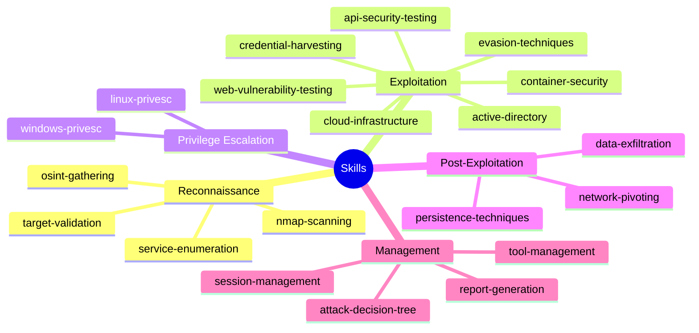
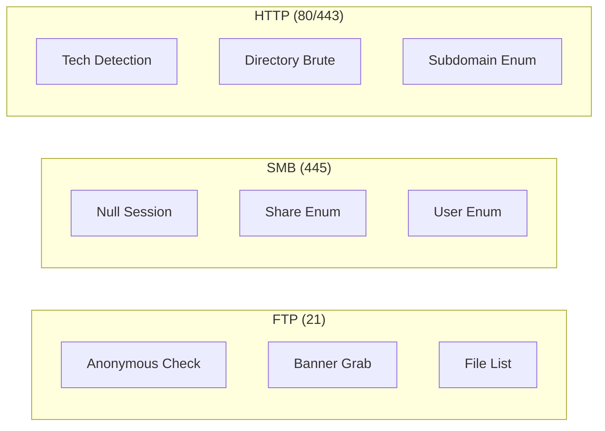
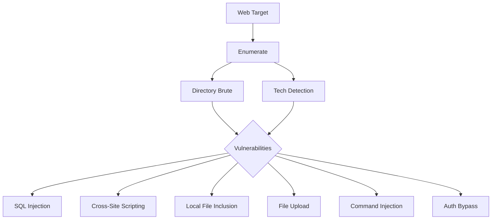
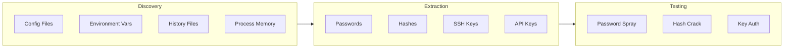
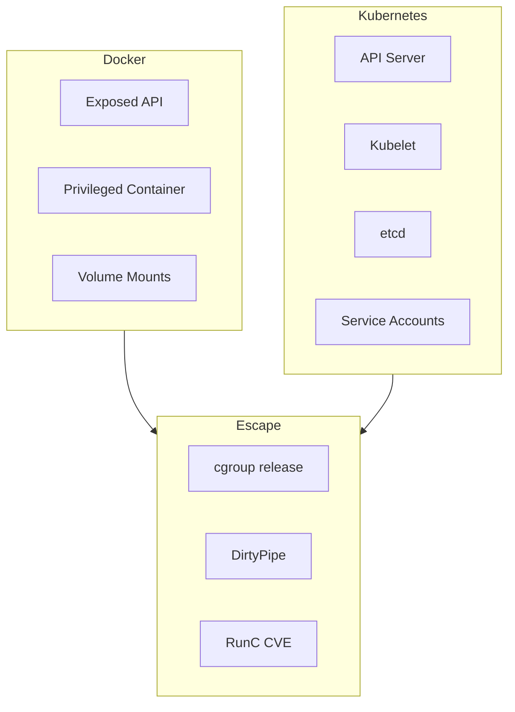
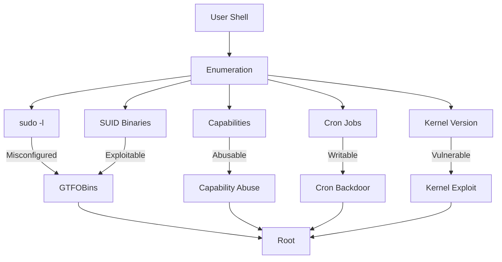
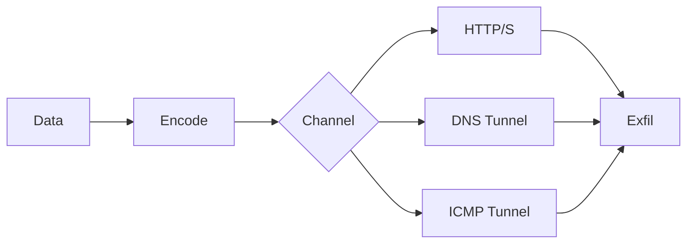

# Clicky Skills

> **Navigation**: [Usage](usage.md) | [Architecture](architecture.md) | [Agents](agents.md) | [Workflow](workflow.md) | [Skills](skills.md) | [README](../README.md)

---

## Skills Overview

Skills are modular technique libraries that agents invoke to perform specific actions. Each skill contains scripts, templates, and documentation for a particular capability.



---

## Reconnaissance Skills

### nmap-scanning

Port and service enumeration techniques.

| Scan Type | Command | Use Case |
|-----------|---------|----------|
| Quick | `nmap -T4 -F` | Initial discovery |
| Full TCP | `nmap -p-` | Complete enumeration |
| Service | `nmap -sV -sC` | Version detection |
| UDP | `nmap -sU --top-ports 100` | UDP services |
| Aggressive | `nmap -A` | Full fingerprint |

**Output Formats**: Normal, grepable, XML

### service-enumeration

Service-specific enumeration techniques.



### osint-gathering

Open source intelligence collection.

| Source | Data Type | Tool |
|--------|-----------|------|
| DNS | Subdomains, records | dig, host |
| WHOIS | Registration | whois |
| Certificate | Alt names | crt.sh |
| Search | Indexed pages | Google dorks |

### target-validation

Target verification and scope checking.

- IP format validation
- Domain resolution
- Liveness check (ping, TCP)
- Scope boundary enforcement

---

## Exploitation Skills

### web-vulnerability-testing

Web application attack techniques.



| Vulnerability | Detection | Exploitation |
|---------------|-----------|--------------|
| SQLi | Error/Time based | sqlmap, manual |
| XSS | Reflection test | Script injection |
| LFI | Path traversal | PHP wrappers |
| Upload | Extension test | Webshell |
| CMDi | Delimiter test | OS commands |

### api-security-testing

API attack techniques.

| API Type | Test | Attack |
|----------|------|--------|
| REST | Endpoint enum | IDOR, injection |
| GraphQL | Introspection | Query manipulation |
| JWT | Token analysis | Algorithm confusion |
| OAuth | Flow analysis | Token theft |

**MITRE Techniques**: T1106, T1550.001, T1499, T1090

### credential-harvesting

Credential discovery and extraction.



### active-directory

Active Directory attack techniques.

| Phase | Technique | Tool |
|-------|-----------|------|
| Enum | LDAP queries | ldapsearch |
| Enum | User/Group list | enum4linux |
| Attack | Kerberoasting | GetUserSPNs |
| Attack | AS-REP Roast | GetNPUsers |
| Attack | Pass-the-Hash | psexec |
| Pivot | BloodHound | neo4j |

**Attack Path**:

```text
User Enum -> Password Spray -> Kerberoast -> Crack -> Lateral Move -> DA
```

### container-security

Container and orchestration attacks.



### cloud-infrastructure

Cloud platform attacks.

| Provider | Service | Attack |
|----------|---------|--------|
| AWS | S3 | Public bucket enum |
| AWS | EC2 | Metadata abuse |
| AWS | IAM | Role assumption |
| Azure | Blob | Anonymous access |
| Azure | MI | Token extraction |
| GCP | Storage | Bucket enum |

### evasion-techniques

Detection avoidance methods.

- WAF bypass patterns
- IPS evasion (fragmentation, encoding)
- Log evasion (timestomping)
- AV bypass (obfuscation)

---

## Privilege Escalation Skills

### linux-privesc

Linux privilege escalation techniques.



**Priority Order**:

1. SUDO misconfiguration [+++]
2. SUID/SGID binaries [++]
3. Capabilities [++]
4. Writable files [+++]
5. Cron jobs [+]
6. Kernel exploits [-]

### windows-privesc

Windows privilege escalation techniques.

| Technique | Check | Tool |
|-----------|-------|------|
| Token Abuse | `whoami /priv` | PrintSpoofer |
| Service Misconfig | `sc query` | Service exploit |
| Scheduled Task | `schtasks /query` | Task modification |
| Registry | `reg query` | AlwaysInstallElevated |
| Stored Creds | Credential Manager | mimikatz |
| DLL Hijack | Process Monitor | Malicious DLL |

---

## Post-Exploitation Skills

### persistence-techniques

Maintaining access methods.

| Platform | Method | Location |
|----------|--------|----------|
| Linux | SSH key | ~/.ssh/authorized_keys |
| Linux | Cron | /etc/cron.d/ |
| Linux | Service | /etc/systemd/ |
| Windows | Registry | Run keys |
| Windows | Task | Task Scheduler |
| Windows | Service | Service creation |

### data-exfiltration

Covert data transfer methods.



### network-pivoting

Lateral movement techniques.

| Method | Tool | Use Case |
|--------|------|----------|
| SSH Tunnel | ssh -L/-R/-D | Port forward |
| SOCKS Proxy | chisel, proxychains | Network access |
| Port Forward | socat, netsh | Single port |

---

## Management Skills

### session-management

Session and state handling.

**Functions**:
- Session creation with unique ID
- State persistence to JSON
- Checkpoint creation
- Recovery from failure

**State Keys**:

```yaml
recon_complete: boolean
services_found: array
credentials: object
access_level: none|user|root
```

### attack-decision-tree

Attack logic derived from pentesting research.

**Service Priorities**:

```text
FTP (anon) -> SMB (null) -> HTTP -> SSH -> Other
```

**Attack Chains**:

```text
Chain A: Anonymous -> Creds -> Reuse (85%)
Chain B: Web Vuln -> Shell -> Privesc (75%)
Chain C: Default Creds -> Direct (100% when vuln)
```

### tool-management

Tool availability and fallback.

| Tool | Purpose | Fallback |
|------|---------|----------|
| nmap | Port scan | nc, /dev/tcp |
| gobuster | Dir brute | ffuf, dirb |
| sqlmap | SQLi | Manual injection |
| hydra | Brute force | medusa, ncrack |

### report-generation

Output and documentation.

**Report Formats**:
- JSON (structured data)
- Markdown (human readable)
- Executive Summary
- Technical Findings

**Compliance Mapping**:
- CVSS 3.1 scoring
- OWASP Top 10 alignment
- CIS Benchmark references
- MITRE ATT&CK techniques

---

## Skill Directory Structure

Skills in Claude Code follow this directory structure within `.claude/skills/`:

```text
.claude/skills/{skill-name}/
|-- SKILL.md           # Main skill definition (required)
|-- scripts/           # Executable scripts
|   |-- main.sh
|   |-- helpers/
|-- references/        # Documentation and cheat sheets
|-- assets/            # Wordlists, templates, supporting files
```

**SKILL.md** is the required entry point. It contains:

- Skill description and purpose
- Command syntax and examples
- Technique documentation
- References to scripts and assets

## Skill Invocation

Agents invoke skills by referencing them in their YAML frontmatter. When an agent needs a capability, it uses the skill's documented techniques:

```markdown
---
name: exploit-agent
skills:
  - web-vulnerability-testing
  - credential-harvesting
---
```

The agent then has access to the skill's SKILL.md content and can execute scripts from the `scripts/` directory:

```bash
# Using a skill script
.claude/skills/web-vulnerability-testing/scripts/sqli-test.sh http://target/login
```
