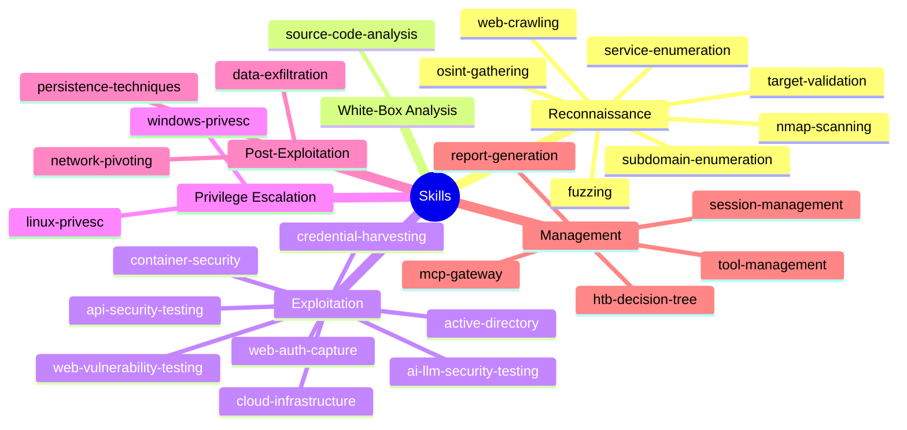
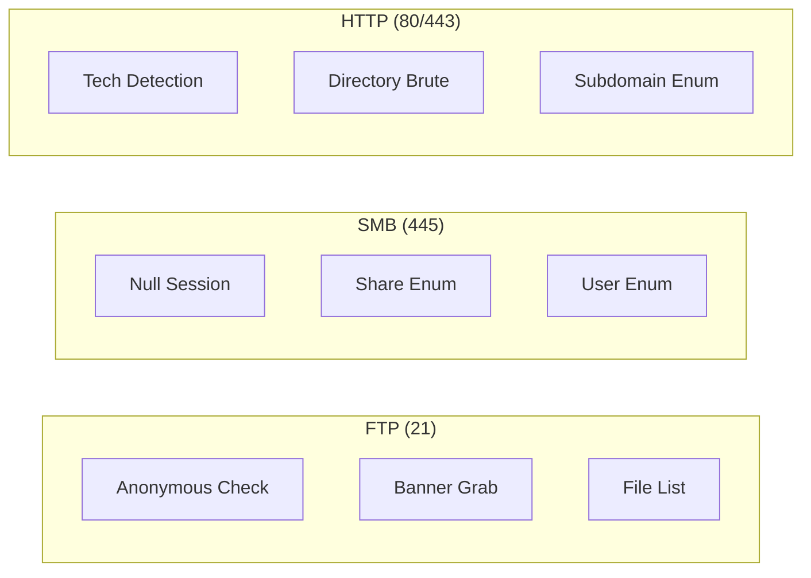
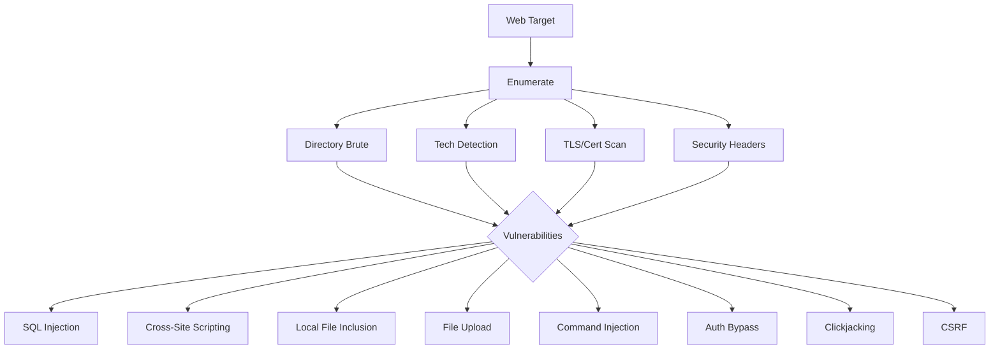
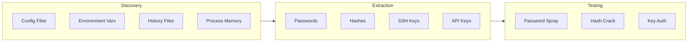
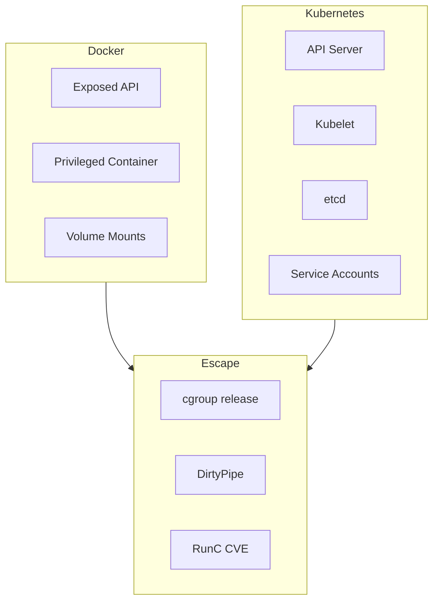
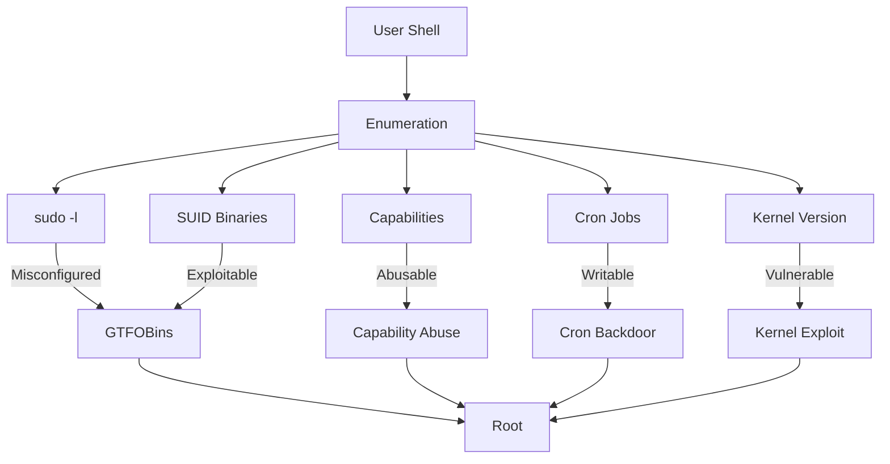
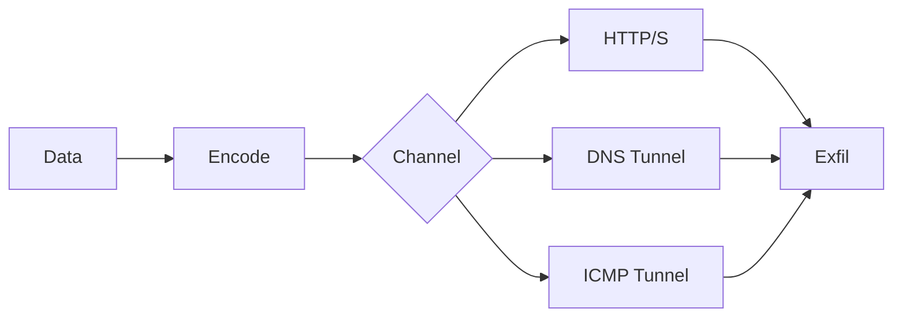

# Clicky Skills

> **Navigation**: [Usage](usage.md) | [Architecture](architecture.md) | [Agents](agents.md) | [Workflow](workflow.md) | [Skills](skills.md) | [Observability](observability.md) | [Sandboxing](sandboxing.md) | [README](../README.md)

---

## Skills Overview

Skills are modular technique libraries that agents invoke to perform specific actions. Each skill contains scripts, templates, and documentation for a particular capability.


```mermaid
mindmap
  root((Skills))
    Reconnaissance
      nmap-scanning
      service-enumeration
      osint-gathering
      target-validation
      fuzzing
      web-crawling
      subdomain-enumeration
    White-Box Analysis
      source-code-analysis
    Exploitation
      web-vulnerability-testing
      api-security-testing
      ai-llm-security-testing
      credential-harvesting
      web-auth-capture
      active-directory
      container-security
      cloud-infrastructure
    Privilege Escalation
      linux-privesc
      windows-privesc
    Post-Exploitation
      persistence-techniques
      data-exfiltration
      network-pivoting
    Management
      mcp-gateway
      session-management
      htb-decision-tree
      tool-management
      report-generation
```

---

## Reconnaissance Skills

### nmap-scanning

Port and service enumeration techniques.

| Scan Type | Command | Use Case |
|-----------|---------|----------|
| Quick | `nmap -T4 -F` | Initial discovery |
| Full TCP | `nmap -p-` | Complete enumeration |
| Service | `nmap -sV -sC` | Version detection |
| UDP | `nmap -sU --top-ports 100` | UDP services |
| Aggressive | `nmap -A` | Full fingerprint |

**Output Formats**: Normal, grepable, XML

### service-enumeration

Service-specific enumeration techniques.


```mermaid
flowchart LR
    subgraph FTP["FTP (21)"]
        F1[Anonymous Check]
        F2[Banner Grab]
        F3[File List]
    end

    subgraph SMB["SMB (445)"]
        S1[Null Session]
        S2[Share Enum]
        S3[User Enum]
    end

    subgraph HTTP["HTTP (80/443)"]
        H1[Tech Detection]
        H2[Directory Brute]
        H3[Subdomain Enum]
    end
```

### osint-gathering

Open source intelligence collection.

| Source | Data Type | Tool |
|--------|-----------|------|
| DNS | Subdomains, records | dig, host |
| WHOIS | Registration | whois |
| Certificate | Alt names | crt.sh |
| Search | Indexed pages | Google dorks |

### target-validation

Target verification and scope checking.

- IP format validation
- Domain resolution
- Liveness check (ping, TCP)
- Scope boundary enforcement

### fuzzing

Directory/vhost/parameter fuzzing with a tool-preference cascade (ffuf -> feroxbuster -> gobuster -> dirb -> wfuzz -> curl fallback). Consolidates what used to be scattered ffuf/gobuster mentions across `recon-agent`, `web-vulnerability-testing`, and `api-security-testing` into one script with real response filtering, recursive/vhost fuzzing, and `--auth-file` support for targets behind a login wall. See `skills/fuzzing/SKILL.md`.

### web-crawling

JS-aware endpoint discovery via katana (preferred) -> hakrawler -> stdlib-only static HTML link extraction. Closes the gap left by fixed-endpoint-path probing against modern SPA targets that only expose routes via client-side JavaScript/XHR. See `skills/web-crawling/SKILL.md`.

### subdomain-enumeration

DNS attack-surface mapping: a source cascade (crt.sh certificate-transparency search - always runs, free, no key - then subfinder, then amass, each skipped gracefully rather than failing if not installed) merges and dedupes candidate subdomains, resolves each (CNAME/A records), and fingerprints resolved CNAMEs against a curated subset of the `EdOverflow/can-i-take-over-xyz` reference list to flag possible subdomain takeovers (only a confirmed response-body fingerprint match is reported, not a bare CNAME-suffix match). Passive by default; `--active` opts into amass's own active/brute-force techniques and should only be used when scope explicitly allows it. Feeds `recon-agent`'s new Phase 0 (Attack Surface Mapping), which runs this ahead of port/service discovery whenever the target is a domain rather than a bare IP/range/CIDR - newly discovered subdomains become pivot targets, and a confirmed takeover candidate is handed opportunistically to `exploit-agent`. See `skills/subdomain-enumeration/SKILL.md`.

---

## White-Box Analysis Skills

### source-code-analysis

Used by `source-analyzer-agent` (see [Agents](agents.md#source-analyzer-agent)) when white-box analysis is requested or triggered by an exposed `.git` directory. A different input shape than the black-box skills above - file/line/sink findings, not ports/services - fed to `decision-agent` as a parallel input.

| Script | Purpose |
|--------|---------|
| `source-scanner.sh acquire` | Local path, `git clone`, or reconstruction from an exposed `.git` (falls back to git-dumper/GitTools) |
| `source-scanner.sh scan` | Prefers Semgrep (AST-based, bundled offline ruleset) when installed; falls back to a regex/proximity taint-style scan: SQLi, command/code injection, XSS, path traversal, SSRF, hardcoded secrets |
| `dependency-scanner.sh` | Wraps `trivy fs` (preferred) or per-ecosystem tools (`npm audit`, `pip-audit`, `bundler-audit`, `govulncheck`) for known-CVE dependencies, enriched with EPSS exploit-prediction scores and CISA KEV (known-exploited) status when reachable |

Findings carry a `confidence` of `high` (source and sink both matched) or `low` (sink only, no clear source in range) - report accordingly, never as confirmed. A manifest with no matching scanner installed is reported as "could not check" (`skipped`), never as "no vulnerabilities found." See `docs/workflow.md` for how these findings flow through the same Tier 1/Tier 2 validation pipeline as any other claimed finding once `exploit-agent` acts on them.

---

## Exploitation Skills

### web-vulnerability-testing

Web application attack techniques. Most of this skill is payload-reference prose (SQLi/XSS/LFI/RFI/command-injection/auth-bypass/upload payloads), but it also has two real scripts covering categories that don't reduce to a payload list:

- `scripts/tls-scan.sh --target <host> [--port 443] [--output <json>]` — TLS/certificate weaknesses (deprecated protocol versions, expired/self-signed/hostname-mismatched certs, known CVEs when `testssl.sh` is available). Tool-preference cascade: `testssl.sh` → `sslscan` → `nmap` → an `openssl s_client` fallback that's always available but coarser (protocol-negotiation only, no cipher-suite/CVE detection) — the output's `tool_used` field says which one ran.
- `scripts/security-headers-check.sh --url <url> [--auth-file <path>] [--output <json>]` — one fetch covering clickjacking (`X-Frame-Options`/CSP `frame-ancestors` absence), CSRF passive signals (`SameSite` cookie attribute, anti-CSRF token field presence in forms — a lead worth confirming manually, not a functional CSRF exploit test), and HSTS/`X-Content-Type-Options` presence.


```mermaid
flowchart TD
    WEB[Web Target] --> ENUM[Enumerate]
    ENUM --> DIR[Directory Brute]
    ENUM --> TECH[Tech Detection]
    ENUM --> TLS[TLS/Cert Scan]
    ENUM --> HDRS[Security Headers]

    DIR --> VULNS{Vulnerabilities}
    TECH --> VULNS
    TLS --> VULNS
    HDRS --> VULNS

    VULNS --> SQLI[SQL Injection]
    VULNS --> XSS[Cross-Site Scripting]
    VULNS --> LFI[Local File Inclusion]
    VULNS --> UPLOAD[File Upload]
    VULNS --> CMDI[Command Injection]
    VULNS --> AUTH[Auth Bypass]
    VULNS --> CLICKJACK[Clickjacking]
    VULNS --> CSRF[CSRF]
```

| Vulnerability | Detection | Exploitation |
|---------------|-----------|--------------|
| SQLi | Error/Time based | sqlmap, manual |
| XSS | Reflection test | Script injection |
| LFI | Path traversal | PHP wrappers |
| Upload | Extension test | Webshell |
| CMDi | Delimiter test | OS commands |
| TLS/cert weaknesses | `tls-scan.sh` | Protocol downgrade, cert-trust abuse |
| Clickjacking | `security-headers-check.sh` | Framed state-changing action |
| CSRF | `security-headers-check.sh` (passive signal only) | Manual cross-origin forged request |

### api-security-testing

API attack techniques.

| API Type | Test | Attack |
|----------|------|--------|
| REST | Endpoint enum | IDOR, injection |
| GraphQL | Introspection | Query manipulation |
| JWT | Token analysis | Algorithm confusion |
| OAuth | Flow analysis | Token theft |
| Shadow/historical APIs | `scripts/shadow-api-discovery.sh --domain <domain> [--known-endpoints-file <file>] [--output <json>]` | Unmonitored endpoint still reachable |

`shadow-api-discovery.sh` covers OWASP API9:2023 (Improper Inventory Management) beyond live-endpoint discovery: one free, unauthenticated call to the Wayback Machine's CDX API for historically-indexed `/api/*` paths under a domain, diffed against a plain JSON array of currently-known endpoints if given. `shadow_endpoints` in its output is what was indexed historically but is absent from current discovery — a lead worth confirming by hand, not a confirmed finding on its own.

**MITRE Techniques**: T1550.001 (JWT/token theft). Most API-specific vulnerability classes (IDOR, mass assignment, CORS, SSRF) don't have clean MITRE ATT&CK mappings — ATT&CK models adversary behavior, not web-app vulnerability taxonomy. See the [OWASP API Security Top 10](skills.md#api-security-testing) mapping in `api-security-testing/SKILL.md` instead.

### ai-llm-security-testing

AI/LLM application security testing: prompt injection and jailbreak probes via canary-token detection (a freshly generated unique token is substituted into a payload; a hard pass/fail is whether that exact token shows up in the response), system-prompt-extraction probes (no automated verdict - response is captured for manual review), an OWASP Top 10 for LLM Applications (2025) checklist for categories that don't reduce to a scriptable black-box probe (sensitive info disclosure, supply chain, data/model poisoning, improper output handling, excessive agency, vector/embedding weaknesses, misinformation, unbounded consumption), and - for classical/non-LLM ML models (exposed model-serving endpoints, raw model artifacts) rather than chat-style apps - a separate OWASP Machine Learning Security Top 10 (2023) checklist. Findings use a deliberate `owasp_llm` field instead of `mitre_attack` - ATT&CK IDs don't map cleanly to this domain either. Probed endpoints also export as a partial AIBOM (CycloneDX 1.5, via `report-generation`'s `interop-formats.sh aibom-partial`). See `skills/ai-llm-security-testing/SKILL.md`.

### credential-harvesting

Credential discovery and extraction.


```mermaid
flowchart LR
    subgraph Discovery
        D1[Config Files]
        D2[Environment Vars]
        D3[History Files]
        D4[Process Memory]
    end

    subgraph Extraction
        E1[Passwords]
        E2[Hashes]
        E3[SSH Keys]
        E4[API Keys]
    end

    subgraph Testing
        T1[Password Spray]
        T2[Hash Crack]
        T3[Key Auth]
    end

    Discovery --> Extraction --> Testing
```

### web-auth-capture

Captures an authenticated web-app session (cookies, bearer token, CSRF token) via manual paste, a curl-driven login POST, or HAR import - so `skills/fuzzing`, `skills/web-crawling`, and exploitation steps generally can reach endpoints behind a login wall via a shared `--auth-file` flag instead of each reinventing login handling.

- `manual` - paste a `Cookie:`/`Authorization:` value already captured from your own browser
- `curl-login` - POST a login form, with best-effort CSRF field auto-discovery (classic server-rendered forms only)
- `from-har` - import a browser devtools/mitmproxy HAR export (the only path that reliably covers JS-rendered SPA logins)

No live proxy interception - doesn't fit Claude Code's one-shot foreground Bash tool model. See `skills/web-auth-capture/SKILL.md` for the full schema and known limitations.

### active-directory

Active Directory attack techniques.

| Phase | Technique | Tool |
|-------|-----------|------|
| Enum | LDAP queries | ldapsearch |
| Enum | User/Group list | enum4linux |
| Attack | Kerberoasting | GetUserSPNs |
| Attack | AS-REP Roast | GetNPUsers |
| Attack | Pass-the-Hash | psexec |
| Pivot | BloodHound | neo4j |

**Attack Path**:

```text
User Enum -> Password Spray -> Kerberoast -> Crack -> Lateral Move -> DA
```

### container-security

Container and orchestration attacks.


```mermaid
flowchart TD
    subgraph Docker
        D1[Exposed API]
        D2[Privileged Container]
        D3[Volume Mounts]
    end

    subgraph Kubernetes
        K1[API Server]
        K2[Kubelet]
        K3[etcd]
        K4[Service Accounts]
    end

    subgraph Escape
        E1[cgroup release]
        E2[DirtyPipe]
        E3[RunC CVE]
    end

    Docker --> Escape
    Kubernetes --> Escape
```

### cloud-infrastructure

Cloud platform attacks.

| Provider | Service | Attack |
|----------|---------|--------|
| AWS | S3 | Public bucket enum |
| AWS | EC2 | Metadata abuse |
| AWS | IAM | Role assumption |
| Azure | Blob | Anonymous access |
| Azure | MI | Token extraction |
| GCP | Storage | Bucket enum |

---

## Privilege Escalation Skills

### linux-privesc

Linux privilege escalation techniques.


```mermaid
flowchart TD
    USER[User Shell] --> CHECK[Enumeration]

    CHECK --> SUDO[sudo -l]
    CHECK --> SUID[SUID Binaries]
    CHECK --> CAP[Capabilities]
    CHECK --> CRON[Cron Jobs]
    CHECK --> KERNEL[Kernel Version]

    SUDO -->|Misconfigured| GTFO[GTFOBins]
    SUID -->|Exploitable| GTFO
    CAP -->|Abusable| EXPLOIT[Capability Abuse]
    CRON -->|Writable| BACKDOOR[Cron Backdoor]
    KERNEL -->|Vulnerable| KEXPLOIT[Kernel Exploit]

    GTFO --> ROOT[Root]
    EXPLOIT --> ROOT
    BACKDOOR --> ROOT
    KEXPLOIT --> ROOT
```

**Priority Order**:

1. SUDO misconfiguration [+++]
2. SUID/SGID binaries [++]
3. Capabilities [++]
4. Writable files [+++]
5. Cron jobs [+]
6. Kernel exploits [-]

### windows-privesc

Windows privilege escalation techniques.

| Technique | Check | Tool |
|-----------|-------|------|
| Token Abuse | `whoami /priv` | PrintSpoofer |
| Service Misconfig | `sc query` | Service exploit |
| Scheduled Task | `schtasks /query` | Task modification |
| Registry | `reg query` | AlwaysInstallElevated |
| Stored Creds | Credential Manager | mimikatz |
| DLL Hijack | Process Monitor | Malicious DLL |

---

## Post-Exploitation Skills

### persistence-techniques

Maintaining access methods.

| Platform | Method | Location |
|----------|--------|----------|
| Linux | SSH key | ~/.ssh/authorized_keys |
| Linux | Cron | /etc/cron.d/ |
| Linux | Service | /etc/systemd/ |
| Windows | Registry | Run keys |
| Windows | Task | Task Scheduler |
| Windows | Service | Service creation |

### data-exfiltration

Covert data transfer methods.


```mermaid
flowchart LR
    DATA[Data] --> ENCODE[Encode]
    ENCODE --> CHANNEL{Channel}

    CHANNEL --> HTTP[HTTP/S]
    CHANNEL --> DNS[DNS Tunnel]
    CHANNEL --> ICMP[ICMP Tunnel]

    HTTP --> OUT[Exfil]
    DNS --> OUT
    ICMP --> OUT
```

### network-pivoting

Lateral movement techniques.

| Method | Tool | Use Case |
|--------|------|----------|
| SSH Tunnel | ssh -L/-R/-D | Port forward |
| SOCKS Proxy | chisel, proxychains | Network access |
| Port Forward | socat, netsh | Single port |

---

## Management Skills

### mcp-gateway

The MCP server behind every tool call in the plugin now, not just another skill an agent references. All 9 agents (`recon`, `decision`, `exploit`, `privesc`, `loot`, `cloud-recon`, `source-analyzer`, `verification`, `report`) have had their `tools:` frontmatter rewritten to grant exclusively its 7 `mcp__plugin_clicky_clicky-gateway__*` tools in place of direct Bash/Read/Write/WebFetch - zero direct tool grants remain anywhere else in Clicky. It's registered via `.claude-plugin/plugin.json`'s `mcpServers` block and launched by `scripts/launch.sh`.

| Tool | Purpose |
|------|---------|
| `create_session(target)` | Validates the target and creates a new session; the only tool with no `session_dir` parameter - it produces one |
| `register_target(target, session_dir)` | Scope-checks a target (`enforce`/`warn`/`off`, via the `scope_enforcement` userConfig option) and tokenizes it |
| `execute_command(command, session_dir, timeout_s?)` | Resolves tokens in `command`, runs it through the shell, redacts the result |
| `fetch_url(url, session_dir)` | Resolves tokens in `url`, fetches it, redacts the result |
| `read_file(path, session_dir)` | Resolves tokens in `path`, reads the file, redacts the content |
| `write_file(path, content, session_dir)` | Resolves tokens in both `path` and `content`, writes, confirms |
| `search_files(pattern, path, session_dir)` | Resolves tokens, runs `grep -rn` under `path`, redacts the matches |

Raw target IPs/hostnames and discovered credentials never flow to the model as plain tool-call content: `token_store.py` maintains a two-way token (`TARGET_1`, `CRED_HASH_1`, `CRED_KEY_1`, `CRED_APIKEY_1`, ...) <-> real-value map per session (`$SESSION_DIR/.token-map.json`, mode 0600), resolving tokens to real values before acting and auto-discovering/redacting real values back to tokens in whatever it returns. `register_target` is the sole scope-check chokepoint - every other tool operates only on values already registered through it. See `skills/mcp-gateway/SKILL.md` for the full token scheme, scope-check/elicitation flow, and session-context design.

### session-management

Session and state handling.

**Functions**:
- Session creation with unique ID
- State persistence to JSON
- Checkpoint creation
- Recovery from failure

**State Keys**:

```yaml
recon_complete: boolean
services_found: array
credentials: object
access_level: none|user|root
```

### htb-decision-tree

Attack logic, self-calibrated from this operator's own accumulated session history (real measured success rates once enough data exists, honest heuristic ordering otherwise - see `skills/htb-decision-tree/SKILL.md`).

**Service Priorities** (illustrative order - see `service-prioritizer.py --show-matrix` for live data):

```text
FTP (anon) -> SMB (null) -> HTTP -> SSH -> Other
```

**Attack Chains**:

```text
Chain A: Anonymous -> Creds -> Reuse
Chain B: Web Vuln -> Shell -> Privesc
Chain C: Default Creds -> Direct
```

### tool-management

Tool availability and fallback.

| Tool | Purpose | Fallback |
|------|---------|----------|
| nmap | Port scan | nc, /dev/tcp |
| gobuster | Dir brute | ffuf, dirb |
| sqlmap | SQLi | Manual injection |
| hydra | Brute force | medusa, ncrack |

### report-generation

Output and documentation.

**Report Formats**:
- JSON (structured data)
- Markdown (human readable)
- Executive Summary
- Technical Findings

**Compliance Mapping**:
- CVSS 3.1 scoring
- OWASP Top 10 alignment
- CIS Benchmark references
- MITRE ATT&CK techniques

**Interop Export Formats** (`interop-formats.sh`, separate from the narrative report above - for CI/tooling consumers):
- SARIF 2.1.0 (from source-code-analysis's source findings)
- CycloneDX 1.5 `sbom-partial` (from dependency findings - named "partial" deliberately, since it's vulnerability-derived, not a full inventory)
- CycloneDX 1.5 `aibom-partial` (from ai-llm-security-testing's probe output - named "partial" for the same reason: black-box probing, no model architecture/weights/provenance, one `machine-learning-model` component per probed endpoint with OWASP LLM Top 10 (2025) coverage attached)
- All three validated against the real published JSON Schemas by an actual re-runnable test (`tests/schema_validation/test_schema_validation.py`, run via `tests/run_all.sh`), not just asserted in prose

---

## Skill Directory Structure

Skills in Claude Code follow this directory structure within `skills/`:

```text
skills/{skill-name}/
|-- SKILL.md           # Main skill definition (required)
|-- scripts/           # Executable scripts
|   |-- main.sh
|   |-- helpers/
|-- references/        # Documentation and cheat sheets
|-- assets/            # Wordlists, templates, supporting files
```

**SKILL.md** is the required entry point. It contains:

- Skill description and purpose
- Command syntax and examples
- Technique documentation
- References to scripts and assets

## Skill Invocation

Agents invoke skills by referencing them in their YAML frontmatter. When an agent needs a capability, it uses the skill's documented techniques:

```markdown
---
name: exploit-agent
skills:
  - web-vulnerability-testing
  - credential-harvesting
---
```

The agent then has access to the skill's SKILL.md content and can execute scripts from the `scripts/` directory:

```bash
# Using a skill script
skills/web-vulnerability-testing/scripts/tls-scan.sh --target host --port 443 --output tls_scan.json
```
