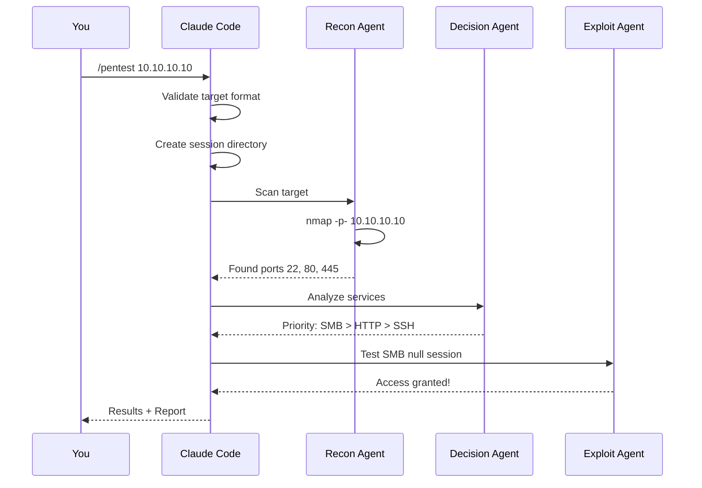

# Clicky Usage Guide

> **Navigation**: [Usage](usage.md) | [Architecture](architecture.md) | [Agents](agents.md) | [Workflow](workflow.md) | [Skills](skills.md) | [README](../README.md)

---

## Table of Contents

1. [Introduction](#introduction)
2. [Prerequisites](#prerequisites)
3. [Quick Start](#quick-start)
4. [The /pentest Command](#the-pentest-command)
5. [Understanding Arguments](#understanding-arguments)
6. [Session Management](#session-management)
7. [Reading Output](#reading-output)
8. [Common Scenarios](#common-scenarios)
9. [Troubleshooting](#troubleshooting)
10. [Advanced Usage](#advanced-usage)

---

## Introduction

### What is This Guide?

This guide teaches you how to use Clicky for penetration testing. Whether you're running your first scan or optimizing complex attack chains, this document covers everything from basic commands to advanced techniques.

### Who Is This For?

- **Beginners**: New to penetration testing or Claude Code
- **Students**: Learning security concepts through hands-on practice
- **Professionals**: Looking for efficient, automated testing workflows

### What You'll Learn

By the end of this guide, you'll understand:

- How to invoke the `/pentest` command
- What arguments to provide and when
- How to interpret results
- How to handle common issues
- Advanced customization options

---

## Prerequisites

### Required Software

Before using Clicky, ensure you have:

| Software | Purpose | Installation |
|----------|---------|--------------|
| Claude Code CLI | AI orchestration | `npm install -g @anthropic-ai/claude-code` |
| nmap | Port scanning | `apt install nmap` or `brew install nmap` |
| curl | HTTP requests | Usually pre-installed |

### Optional (Recommended) Tools

These tools enhance Clicky's capabilities:

| Tool | Purpose | When Needed |
|------|---------|-------------|
| sqlmap | SQL injection | Web application testing |
| hydra | Password brute-forcing | Credential attacks |
| smbclient | SMB enumeration | Windows/Samba targets |
| enum4linux | SMB/NetBIOS enumeration | Active Directory |
| gobuster/ffuf | Directory brute-forcing | Web enumeration |
| docker | Container testing | Container security |
| aws/az/gcloud | Cloud CLIs | Cloud infrastructure |

### Checking Your Setup

Run this command to verify your environment:

```bash
# Check Claude Code
claude --version

# Check essential tools
which nmap curl

# Check optional tools
which sqlmap hydra smbclient
```

### What is a CLI?

A **CLI (Command Line Interface)** is a text-based way to interact with your computer. Instead of clicking buttons, you type commands. Claude Code runs in your terminal, and you interact with it by typing commands like `/pentest`.

---

## Quick Start

### Your First Scan

The simplest way to use Clicky:

```bash
# Start Claude Code in your terminal
claude

# Run a basic penetration test
/pentest 10.10.10.10
```

That's it. Clicky will:

1. Validate the target
2. Create a session
3. Scan all ports
4. Analyze results
5. Attempt exploitation
6. Generate a report

### What Happens Behind the Scenes?



---

## The /pentest Command

### Command Anatomy

```text
/pentest <target> ["context"]
   │        │          │
   │        │          └── Optional: Additional information
   │        └───────────── Required: IP address or domain
   └────────────────────── The command itself
```

### What is a Slash Command?

In Claude Code, commands starting with `/` are **slash commands**. They're shortcuts that trigger predefined workflows. When you type `/pentest`, Claude Code loads a template that orchestrates the entire penetration testing process.

### How /pentest Works

The `/pentest` command is defined in `.claude/commands/pentest.md`. This file contains:

1. **Frontmatter**: Configuration (model, tools, permissions)
2. **Template**: The workflow instructions
3. **Variables**: Placeholders like `{{TARGET}}` that get replaced with your input

```text
Your input:    /pentest 10.10.10.10 "user: admin"
                  │          │              │
                  │          │              └── Becomes {{SUMMARY}}
                  │          └──────────────── Becomes {{TARGET}}
                  └─────────────────────────── Triggers the command
```

### Command Configuration

The `/pentest` command runs with these settings:

| Setting | Value | Meaning |
|---------|-------|---------|
| model | claude-sonnet-4-5 | Uses Sonnet for orchestration |
| thinking | true | Enables extended reasoning |
| permissionMode | ask | Asks before sensitive actions |

### Allowed Tools

Clicky can use these tools during a pentest:

**Network Tools**: nmap, curl, nc, dig, nslookup
**Exploitation**: sqlmap, hydra, smbclient, ftp, ssh
**System**: ls, cat, grep, find, ps, id, whoami
**Cloud**: aws, az, gcloud, docker
**File Operations**: Read, Write, Edit, Grep

---

## Understanding Arguments

### The Target Argument (Required)

The target is the system you're testing. It can be:

**IP Address**:

```bash
/pentest 10.10.10.10
/pentest 192.168.1.100
```

**Domain Name**:

```bash
/pentest example.com
/pentest api.target.local
```

**With Port** (for specific service testing):

```bash
/pentest 10.10.10.10:8080
```

### The Context Argument (Optional)

Context provides additional information that helps Clicky work smarter. It's enclosed in quotes and can contain:

**Credentials**:

```bash
/pentest 10.10.10.10 "user: admin, password: Password123"
```

Why provide credentials? If you've already discovered credentials (from OSINT, previous tests, or the client), Clicky can:

- Skip brute-force attempts (saves time)
- Test credential reuse across services
- Focus on post-exploitation

**Environment Hints**:

```bash
/pentest 10.10.10.10 "cloud: AWS, region: us-east-1"
/pentest 10.10.10.10 "os: Windows Server 2019"
/pentest 10.10.10.10 "framework: WordPress"
```

**Service Information**:

```bash
/pentest api.example.com "type: GraphQL, auth: JWT"
/pentest 10.10.10.10 "service: kubernetes, namespace: production"
```

**Multiple Context Items**:

```bash
/pentest 10.10.10.10 "user: admin, password: admin123, os: Linux, service: docker"
```

### Context Parsing

Clicky parses your context using key-value pairs:

```text
"user: admin, password: Password123"
   │      │        │          │
   │      │        │          └── Value
   │      │        └───────────── Key
   │      └────────────────────── Value
   └───────────────────────────── Key
```

Common keys Clicky understands:

| Key | Purpose | Example |
|-----|---------|---------|
| user/username | Login username | `user: admin` |
| password/pass | Login password | `password: secret` |
| cloud | Cloud provider | `cloud: AWS` |
| os | Operating system | `os: Windows` |
| service | Specific service | `service: kubernetes` |
| type | API/service type | `type: GraphQL` |
| auth | Authentication type | `auth: JWT` |
| domain | AD domain | `domain: corp.local` |

---

## Session Management

### What is a Session?

A **session** is a workspace for your pentest. It stores:

- Scan results
- Discovered credentials
- Exploitation logs
- Generated reports

### Session Structure

When you run `/pentest`, Clicky creates:

```text
~/.claude/sessions/{SESSION_ID}/
├── recon/           # Scan results
│   ├── nmap/        # Port scan outputs
│   └── services/    # Service-specific enumeration
├── loot/            # Extracted data
│   ├── credentials.txt
│   └── files/
├── exploit/         # Exploitation attempts
├── privesc/         # Privilege escalation
└── reports/         # Final reports
```

### Session IDs

Each session gets a unique ID based on:

- Timestamp
- Target identifier
- Random suffix

Example: `pentest_20251126_143022_10_10_10_10`

### Finding Your Session

```bash
# List recent sessions
ls -la ~/.claude/sessions/

# Find session for specific target
ls ~/.claude/sessions/ | grep "10_10_10"
```

### Session Persistence

Sessions persist across Claude Code restarts. If something fails, you can:

1. Review what was completed
2. Resume from the last checkpoint
3. Access all gathered data

---

## Reading Output

### Understanding the Workflow

As Clicky runs, you'll see output from different phases:

```text
[Session] Initialized: pentest_20251126_143022
[Recon] Starting port scan on 10.10.10.10
[Recon] Discovered: 22/tcp (SSH), 80/tcp (HTTP), 445/tcp (SMB)
[Decision] Priority analysis complete
[Decision] Attack order: SMB (P1) → HTTP (P2) → SSH (P3)
[Exploit] Testing SMB null session...
[Exploit] SUCCESS: Null session allowed
[Loot] Extracting files from SMB shares...
```

### Phase Indicators

| Prefix | Agent | What's Happening |
|--------|-------|------------------|
| [Session] | Orchestrator | Session management |
| [Recon] | Recon Agent | Port/service scanning |
| [Decision] | Decision Agent | Strategic analysis |
| [Exploit] | Exploit Agent | Vulnerability testing |
| [Privesc] | Privesc Agent | Privilege escalation |
| [Loot] | Loot Agent | Data extraction |
| [Cloud] | Cloud Recon | Cloud enumeration |

### Priority Levels

When the Decision Agent reports priorities:

| Priority | Symbol | Meaning |
|----------|--------|---------|
| P1 | `[+++]` | Attack immediately - high success rate |
| P2 | `[++]` | Attack after P1 exhausted |
| P3 | `[+]` | Standard attack vector |
| P4 | `[-]` | Last resort |

### Success/Failure Indicators

```text
[+] SUCCESS: Anonymous FTP access granted
[-] FAILED: SSH brute force unsuccessful
[!] WARNING: WAF detected, adjusting approach
[*] INFO: Testing next vector...
```

### Reading Scan Results

Nmap output example:

```text
PORT    STATE SERVICE     VERSION
22/tcp  open  ssh         OpenSSH 8.2p1
80/tcp  open  http        Apache 2.4.41
445/tcp open  netbios-ssn Samba 4.11.6
```

Understanding this:

- **PORT**: The port number and protocol (tcp/udp)
- **STATE**: open (accessible), closed, filtered (firewall)
- **SERVICE**: What's running on that port
- **VERSION**: Specific version (critical for finding exploits)

---

## Common Scenarios

### Scenario 1: Basic Infrastructure Test

**Situation**: You have an IP address and no other information.

```bash
/pentest 10.10.10.10
```

**What Clicky Does**:

1. Full port scan (all 65535 ports)
2. Service version detection
3. Follows attack priority: FTP → SMB → HTTP → SSH
4. Tests default credentials
5. Attempts known exploits for detected versions

### Scenario 2: Web Application Test

**Situation**: You know the target runs a web application.

```bash
/pentest webapp.example.com "framework: WordPress, os: Linux"
```

**What Clicky Does**:

1. Focused web enumeration
2. WordPress-specific checks (wp-login, xmlrpc, plugins)
3. SQL injection testing
4. File upload vulnerability checks
5. LFI/RFI testing

### Scenario 3: With Known Credentials

**Situation**: You have credentials from OSINT or a previous phase.

```bash
/pentest 10.10.10.10 "user: svc_backup, password: Backup2024!"
```

**What Clicky Does**:

1. Skips brute-force (saves hours)
2. Tests credentials on ALL services
3. Focuses on post-exploitation
4. Attempts privilege escalation immediately

### Scenario 4: Cloud/Container Target

**Situation**: Target is in AWS with Kubernetes.

```bash
/pentest k8s.example.com "cloud: AWS, service: kubernetes"
```

**What Clicky Does**:

1. Cloud-specific reconnaissance
2. Kubernetes API enumeration
3. RBAC misconfiguration checks
4. Container escape vectors
5. IAM role analysis
6. S3 bucket enumeration

### Scenario 5: Active Directory Environment

**Situation**: Windows domain environment.

```bash
/pentest 10.10.10.10 "domain: corp.local, os: Windows"
```

**What Clicky Does**:

1. SMB/LDAP enumeration
2. User and group enumeration
3. Kerberoasting attempts
4. AS-REP Roasting
5. Password spraying (if users found)
6. BloodHound-style path analysis

### Scenario 6: API Security Test

**Situation**: Testing a GraphQL API with JWT auth.

```bash
/pentest api.example.com "type: GraphQL, auth: JWT"
```

**What Clicky Does**:

1. GraphQL introspection query
2. Schema analysis
3. JWT algorithm confusion testing
4. IDOR checks
5. Query depth/complexity abuse
6. Batching attacks

---

## Troubleshooting

### Common Issues

#### "Invalid target" Error

**Problem**: Clicky rejects your target.

**Causes**:

- Typo in IP address
- Domain doesn't resolve
- Target not reachable

**Solutions**:

```bash
# Verify IP format
echo "10.10.10.10" | grep -E "^[0-9]+\.[0-9]+\.[0-9]+\.[0-9]+$"

# Check domain resolution
dig example.com

# Test connectivity
ping -c 1 10.10.10.10
```

#### Scan Takes Too Long

**Problem**: Port scan seems stuck.

**Causes**:

- Firewall blocking probes
- Rate limiting
- Network latency

**Solutions**:

- Wait - full scans take 10-20 minutes
- Check if target is actually reachable
- Consider providing known ports in context

#### "Permission Denied" Errors

**Problem**: Commands fail with permission errors.

**Causes**:

- nmap requires root for SYN scans
- Restricted tool access

**Solutions**:

```bash
# Run Claude Code with sudo for network scans
sudo claude

# Or use unprivileged scan modes (slower)
# Clicky automatically falls back to -sT scans
```

#### No Vulnerabilities Found

**Problem**: Clicky completes but finds nothing.

**Causes**:

- Target is well-secured
- Firewall blocking exploitation
- Need different approach

**Solutions**:

1. Review the scan results manually
2. Check for filtered ports (firewall)
3. Try with more context information
4. Consider manual testing for edge cases

#### Tool Not Found

**Problem**: "command not found: sqlmap"

**Causes**:

- Tool not installed
- Not in PATH

**Solutions**:

```bash
# Install missing tool
apt install sqlmap    # Debian/Ubuntu
brew install sqlmap   # macOS

# Or specify path in context
# Clicky uses fallback tools when primary unavailable
```

### Debug Mode

For detailed troubleshooting, examine session files:

```bash
# View session directory
ls -la ~/.claude/sessions/pentest_*/

# Check recon results
cat ~/.claude/sessions/pentest_*/recon/nmap/*.nmap

# Review exploitation attempts
cat ~/.claude/sessions/pentest_*/exploit/*.log
```

### Getting Help

If you're stuck:

1. Check this documentation
2. Review session logs
3. Report issues: https://github.com/anthropics/claude-code/issues

---

## Advanced Usage

### Custom Tool Restrictions

The `/pentest` command allows specific tools. To see what's allowed:

```yaml
# From pentest.md frontmatter
allowed-tools: Bash(nmap:*), Bash(sqlmap:*), Bash(hydra:*), ...
```

### Extending Clicky

#### Adding Custom Skills

Create new skills in `.claude/skills/`:

```text
.claude/skills/my-custom-skill/
├── SKILL.md           # Skill definition
├── scripts/
│   └── my-script.sh   # Custom scripts
└── references/
    └── techniques.md  # Documentation
```

#### Creating Custom Commands

Add commands to `.claude/commands/`:

```markdown
---
name: quick-scan
description: Fast reconnaissance only
allowed-tools: Bash(nmap:*), Read(*), Write(*)
---

# Quick Scan

Perform fast reconnaissance on {{TARGET}} without exploitation.
Only scan top 1000 ports and identify services.
```

### Chaining Commands

Run multiple commands in sequence:

```bash
# First, quick recon
/pentest 10.10.10.10

# If credentials found, test another target
/pentest 10.10.10.11 "user: found_user, password: found_pass"
```

### Integration with Other Tools

Export results for other tools:

```bash
# Nmap results are saved in multiple formats
~/.claude/sessions/*/recon/nmap/scan.xml      # For Metasploit import
~/.claude/sessions/*/recon/nmap/scan.gnmap    # For grep parsing

# Credentials in standard format
~/.claude/sessions/*/loot/credentials.txt     # user:password format
```

### Parallel Testing

For multiple targets, run separate Claude Code instances:

```bash
# Terminal 1
claude
/pentest 10.10.10.10

# Terminal 2
claude
/pentest 10.10.10.11
```

Each maintains its own session and state.

---

## Command Reference

### Quick Reference Card

| Command | Purpose | Example |
|---------|---------|---------|
| `/pentest <ip>` | Basic scan | `/pentest 10.10.10.10` |
| `/pentest <ip> "creds"` | With credentials | `/pentest 10.10.10.10 "user: admin, pass: admin"` |
| `/pentest <domain>` | Domain target | `/pentest example.com` |
| `/pentest <ip> "cloud: X"` | Cloud target | `/pentest 10.10.10.10 "cloud: AWS"` |

### Context Keys Reference

| Key | Values | Purpose |
|-----|--------|---------|
| `user` | string | Username for authentication |
| `password` | string | Password for authentication |
| `cloud` | AWS, Azure, GCP | Cloud provider hint |
| `os` | Linux, Windows | Operating system hint |
| `service` | kubernetes, docker, etc. | Specific service to test |
| `type` | REST, GraphQL, SOAP | API type |
| `auth` | JWT, OAuth, Basic | Authentication mechanism |
| `domain` | string | Active Directory domain |
| `framework` | WordPress, Django, etc. | Web framework hint |

### Output Locations

| Data Type | Location |
|-----------|----------|
| Port scans | `~/.claude/sessions/*/recon/nmap/` |
| Service info | `~/.claude/sessions/*/recon/services/` |
| Credentials | `~/.claude/sessions/*/loot/credentials.txt` |
| Exploit logs | `~/.claude/sessions/*/exploit/` |
| Reports | `~/.claude/sessions/*/reports/` |

---

## Summary

### Key Takeaways

1. **Start simple**: `/pentest <target>` handles most cases
2. **Add context**: Credentials and hints improve results
3. **Trust the process**: Let agents complete their phases
4. **Check sessions**: All data is saved for review
5. **Iterate**: Use findings from one test to inform the next

### The Clicky Philosophy

Clicky automates the repetitive parts of penetration testing while keeping you in control. It follows proven attack patterns but adapts based on what it discovers. Your job is to:

- Provide good targets and context
- Review and validate findings
- Make strategic decisions
- Report responsibly

Happy hacking (ethically)!
